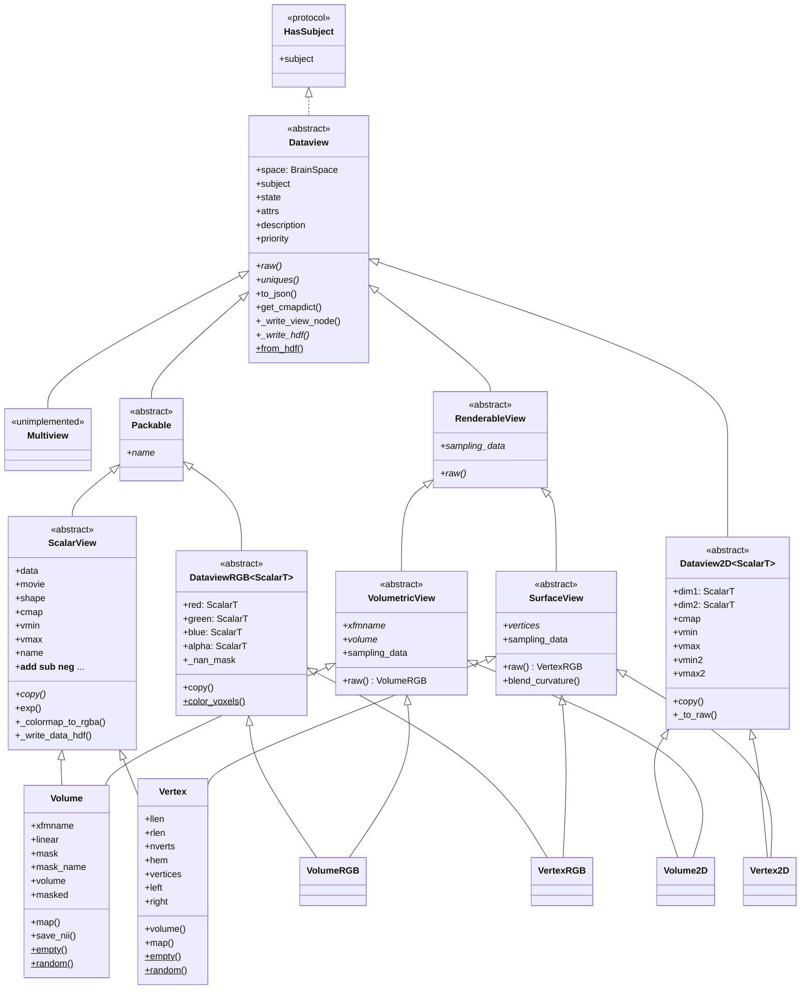
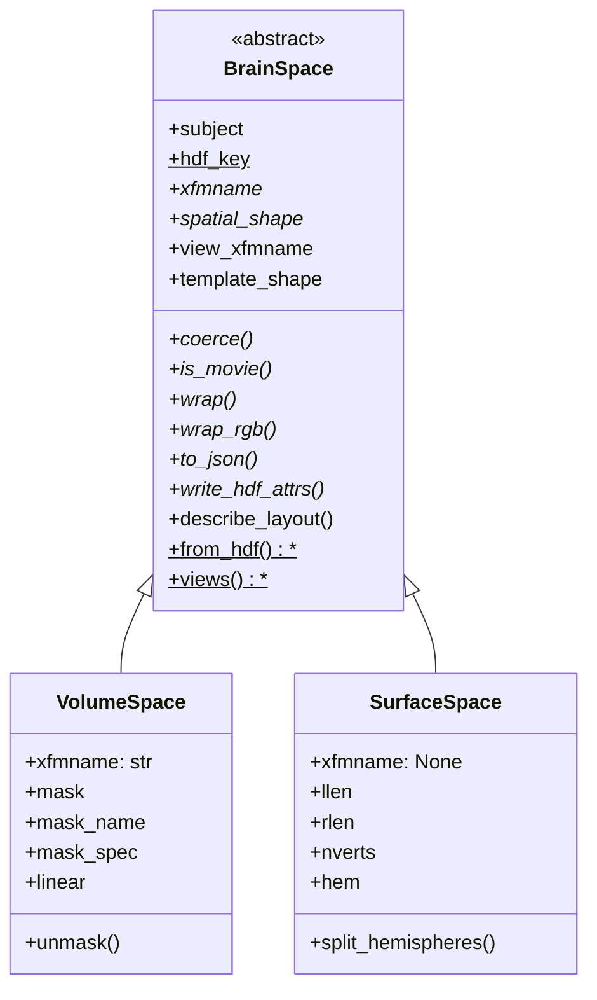

# `cortex.dataset` class hierarchy

Reference for the `Dataview` object graph. See
[TYPING_ALTERNATIVES.md](TYPING_ALTERNATIVES.md) for the restructuring options that
were considered and why this one was chosen.

## Two axes, two mechanisms

The six public classes are a 2x3 grid: two **spaces** crossed with three **channel
layouts**. The two axes are deliberately given different mechanisms.

|  | scalar (1 channel + 1D cmap) | 2D (2 channels + 2D cmap) | RGB (3 channels + alpha) |
| --- | --- | --- | --- |
| **volumetric** | `Volume` | `Volume2D` | `VolumeRGB` |
| **surface** | `Vertex` | `Vertex2D` | `VertexRGB` |
| *abstract base* | `ScalarView` | `Dataview2D` | `DataviewRGB` |

- **Channel layout is the inheritance axis.** All the shared logic -- colormapping,
  HDF, JSON, NaN handling, alpha -- lives in the three abstract bases.
- **Space is a component**, `view.space`, described by a `BrainSpace`. This is the
  open axis: adding a new kind of brain data means adding a space, not
  reimplementing the three bases.

Each concrete class has exactly two bases: its column, which carries all the state
and behaviour, and its spatial interface, which is stateless. That is not the
multiple inheritance this package was restructured to remove. `BrainData` and
`Dataview` used to be unrelated base classes joined only by MI in `Volume` and
`Vertex`, and that MI was load-bearing: `BrainData.to_json` and `VolumeData.copy`
called `super()` methods that existed nowhere in their own ancestry, resolving
only because `Volume`'s MRO threaded through `Dataview`. The spatial interfaces have no
`__init__`, no attributes and no cooperative `super()` chain, so nothing depends
on how they linearize. See [Narrowing the grid](#narrowing-the-grid).



Each concrete class reads down two edges: its column (left) and its spatial
interface (right).
`blend_curvature` is drawn on `SurfaceView` because that is the only place it is
defined; `Vertex` inherits it rather than declaring its own.

### `Packable`: the unit of transport

`Packable` sits between `Dataview` and the two columns that own an array, and it is
what `uniques()` yields. It answers a different question from the spatial axis:

| base | question | who has it |
| --- | --- | --- |
| `Packable` | "is this **one addressable array**?" | scalar and RGB columns |
| `RenderableView` | "can a renderer **sample** this?" | every spatial interface |

Neither implies the other, which is the point of keeping them separate. A 2D view
is renderable but **not** packable: it owns no array, only the two channels it
decomposes into, which is exactly why it has no `name`. Conversely a bare
`ScalarView` subclass is packable but has no spatial interface.

The one member is `name`, a content hash. That is what makes `Dataset.uniques()` a
`set` rather than a list -- two views over identical data collapse to one entry and
are stored and shipped once.

`uniques()` was annotated `Iterator[Dataview]`, which is wider than the truth and
lacks the one member every consumer reaches for first. `webgl.data.Package`
type-checked only because the list it built was `Any`; nothing warned that
`Dataview` has no `name`.

**Do not hoist `name` onto the spatial interface.** `VolumeRGB.name` and `VertexRGB.name` are both
exactly `_hash(self.sampling_data)`, which makes a single definition on
`RenderableView` look free. It is not: `ScalarView.name` hashes the *stored* array,
and for a masked `Volume` that is the flat masked array, not the unmasked 3-D
`sampling_data`. Unifying them silently renames every existing HDF node. Pinned by
`test_packable_name_is_not_hoisted_onto_the_row`. What *can* collapse is the two RGB
definitions into one on `DataviewRGB`, since for RGB the stored array is the sampled
one -- but that needs `DataviewRGB` to see a spatial-interface member.

What `name` addresses is also asymmetric, which is why `Packable` promises only the
name and not what it hashes: for a scalar view it is both the HDF node name and the
browser key, whereas an RGB view writes its channels as four separate HDF nodes and
uses its own `name` only as the browser key.



Source locations:

| Class | Location |
| --- | --- |
| `Dataview`, `ScalarView`, `Volume`, `Vertex`, `Multiview`, `_masker` | `views.py` |
| `HasSubject`, `Packable`, `RenderableView`, `VolumetricView`, `SurfaceView` | `views.py` |
| `as_renderable`, `normalize`, `_detect_space`, `_from_hdf_data` | `views.py` |
| `Dataview2D`, `Volume2D`, `Vertex2D` | `view2D.py` |
| `DataviewRGB`, `VolumeRGB`, `VertexRGB`, `Colors` | `viewRGB.py` |
| `BrainSpace`, `VolumeSpace`, `SurfaceSpace`, the space registry | `_space.py` |
| `Dataset` | `dataset.py` |
| `_hash`, `_hdf_write`, `_find_mask` | `_hdf.py` |

Everything naming the grid lives in `views.py`, next to the classes it names:
there was a `_typing.py` holding the spatial ABCs' aliases and the boundary helper,
but once they became real classes it had nothing left to work around, and its last
occupant -- `as_renderable` -- belongs beside `RenderableView` anyway.
`cortex/dataset/__init__.py` must import `.views`
first — it resolves its circular dependency on `view2D`/`viewRGB` with deferred
imports at the bottom of its own module, so anything reaching those earlier sees a
partially initialised module. A test pins the import order.

`braindata.py` is a compatibility shim: `BrainData`, `VolumeData` and `VertexData`
are aliases for `ScalarView`, `Volume` and `Vertex`. The aliases preserve
`isinstance` exactly -- `isinstance(x, VolumeData)` was only ever true for
`Volume`, since `Volume2D` and `VolumeRGB` never inherited it.

Nothing inside the package reaches through `braindata` any more. `cortex/blender/`
used to (`isinstance(braindata, dataset.braindata.VertexData)`) and now tests
`dataset.Vertex` directly; what remains are `cortex/tests/test_braindata.py`, which
imports `_hash` from there, and `test_dataset.py`, which imports the three aliases
precisely to keep this shim honest. It is kept for code outside the repo. One
submodule path is still pinned internally and must keep resolving:
`cortex.dataset.views.Vertex`, imported by `cortex/database.py`.

## Generics: one covariant TypeVar

`Dataview2D` and `DataviewRGB` are generic in their channel type:

```python
ScalarT = TypeVar("ScalarT", bound=ScalarView, covariant=True)

class Volume2D(Dataview2D[Volume]): ...
class VolumeRGB(DataviewRGB[Volume]): ...
```

So `Volume2D.dim1` is a `Volume` and `VertexRGB.alpha` is a `Vertex` without either
class re-declaring anything. That last one is why the TypeVar earns its keep: **a
property's return type cannot be narrowed by re-annotation, only by re-implementing
the property.** `alpha` used to exist twice, ~25 near-identical lines in each RGB
class, purely because of that.

Covariance is sound here because the channels are read-only properties backed by
private fields, set once in `__init__`. It buys off the usual generics tax:
`Dataview2D[ScalarView]` accepts a `Volume2D`, which an invariant parameter would
reject.

Two limits worth knowing rather than discovering:

- mypy allows a covariant TypeVar in `__init__` parameters and in return position,
  but **not in ordinary method parameters**. The `alpha` setter therefore takes the
  base `ChannelLike`, not `ScalarT`.
- `isinstance(x, DataviewRGB[Volume])` is a runtime `TypeError`. Unsubscripted works
  and narrows to `DataviewRGB[Any]`, which is what the back-compat aliases rely on.

Narrowing a **bare annotation** in a subclass is accepted by mypy; narrowing an
**assigned** ClassVar is not. That asymmetry is why `space` is exposed as a
read-only property over a narrowed private `_space`, and it is exactly what made
the old `_cls` untypeable.

One thing the type system cannot express here: nothing stops
`DataviewRGB[Vertex]` from being declared with a `VolumeSpace`. Tying the space to
the channel would need higher-kinded types, so it stays a runtime constructor
check.

## Adding a new kind of brain data

Four declarations. The three bases supply everything else.

```python
@register_space
class MySpace(BrainSpace):
    hdf_key = "myspace"          # a label; nothing reads it -- see below
    @property
    def xfmname(self): ...                # the transform to sample through, or None
    def coerce(self, data): ...           # validate; record per-array geometry
    def is_movie(self, data): ...         # does it have a leading time axis
    @property
    def spatial_shape(self): ...
    def wrap(self, data, **kw): ...       # build a MyView over `data`
    def wrap_rgb(self, r, g, b, a, **kw): ...   # build a MyViewRGB
    def to_json(self): ...
    def write_hdf_attrs(self, h5, node): ...
    @classmethod
    def from_hdf(cls, attrs, *, subject, xfmname, mask): ...
    @classmethod
    def views(cls):
        return SpaceViews(scalar=MyView, twod=MyView2D, rgb=MyViewRGB)
        # `twod` and `rgb` are read when rebuilding a view from HDF; `scalar` is
        # not, since `wrap()` already builds one. Declared for completeness.

class MyView(ScalarView, MySpatial): ...  # + space-specific accessors
class MyView2D(Dataview2D[MyView], MySpatial): ...  # + a ctor forwarding kwargs
class MyViewRGB(DataviewRGB[MyView], MySpatial): ...
```

Three members are deliberately *not* in that list, because all three are concrete
on `BrainSpace` and most spaces should inherit them:

- `view_xfmname`, derived as `None if self.xfmname is None else [self.xfmname]`, so
  implementing `xfmname` gets slot 7 right for free. Override it only if a space
  needs a slot-7 value that is not just its transform name.
- `template_shape`, the shape a *fresh* array should have, which is what
  `ScalarView.empty` and `random` read. It defaults to `spatial_shape`, which is
  correct whenever the geometry is known as soon as the space is built. Override it
  only if it is not: `VolumeSpace` does, because `spatial_shape` reports the
  geometry of an array already bound by `coerce` and is `()` until then, so a fresh
  volume space has to look its shape up from the transform. Getting this wrong is
  quiet -- `empty` would build a zero-dimensional array rather than fail.
- `describe_layout(data)`, the keys telling the browser how to unpack the array it
  is sent, merged into `to_json(simple=True)`. Empty by default. `VolumeSpace`
  returns `shape` (the grid the mosaic tiles unpack into) and `SurfaceSpace`
  returns `split` (the hemisphere boundary) and `frames`. Distinct from `to_json`,
  which describes the *space* rather than a particular array bound to it -- which
  is why only this one takes the data. These keys are read by `dataset.js`, so
  they are a hard interface.

`hdf_key` is a label rather than a mechanism, despite the name. Detection on load
walks `registered_spaces()` in registration order and takes the first space whose
`from_hdf` returns non-`None`; nothing reads `hdf_key`, and neither built-in writes
a discriminator, because legacy files predate the idea and carry none. It is worth
setting anyway as the one place a space names itself — a space that *does* want a
key on disk has an obvious value to write in `write_hdf_attrs` and match in
`from_hdf`.

### What the space owns, and why

The rule is that anything depending on the *geometry* belongs to the space, so
that adding a space does not mean editing the columns. Three things moved there
because they were the same question asked once per space:

| was | now | it was duplicated as |
| --- | --- | --- |
| `db.get_xfm(...).shape` vs `SurfaceSpace(...).nverts` | `template_shape` | 4 methods (`empty`/`random` x 2 classes) |
| `shape` vs `split`/`frames` in the simple JSON | `describe_layout` | 2 `to_json` overrides, now one on `ScalarView` |
| slicing at `llen`, branching on movie-ness | `SurfaceSpace.split_hemispheres` | 4 properties (`left`/`right` on `Vertex` and `VertexRGB`) |

`split_hemispheres` also removed the one place a view reached *through a channel*
for geometry: `VertexRGB.left` read `self.red.llen` because `DataviewRGB.space` is
typed `BrainSpace`. `VertexRGB` now narrows `space` to `SurfaceSpace` the way
`Vertex` does -- sound because `DataviewRGB[Vertex]` fixes the channel type, which
the generic base cannot state.

What deliberately did **not** move:

- `Volume.map`, `Vertex.map`, `Vertex.volume` -- these transform *between* spaces
  via `cortex.utils.get_mapper`, so they are a property of a space *pair*, and
  putting them on `BrainSpace` would drag the mapper into `_space.py`.
- `Volume.save_nii` -- the affine it needs is a space fact, but writing a file is
  not; only the lookup is a candidate, and it is one line.
- `__repr__` -- the mask description is space knowledge, but the payoff is
  cosmetic.

`MySpatial` is the spatial interface — `VolumetricView` if the data samples through a
transform, `SurfaceView` if it is per-vertex, or a new subclass of
`RenderableView` supplying `sampling_data` if it is sampled some other way. A view
that inherits neither is still a perfectly good `Dataview`; it just cannot be
passed to the flatmap renderers, and `as_renderable` will say so.

`register_space` puts it in the registry that `_from_hdf_data`, `_from_hdf_view`
and `normalize` dispatch through, so HDF round-tripping needs no edits. Order
matters: the registry is consulted in registration order and the first space whose
`from_hdf` returns non-`None` wins. `SurfaceSpace` is deliberately last, because it
accepts anything without a transform -- that is how legacy files, which carry no
space discriminator, are detected. A new space should test for something it writes
itself in `write_hdf_attrs`, and will be consulted ahead of the built-ins.

`space.wrap()` is the abstraction that keeps the rest space-agnostic: the channel
resolvers in `view2D.py` and `viewRGB.py`, and all three HDF factories, build views
through it and never name `Volume` or `Vertex`. A space is per-view, not shared:
`coerce()` records facts that depend on the particular array bound to it (which
mask a flattened array matches, which hemisphere a half-length array covered), so
`wrap()` uses `self` only as a template of parameters.

## Narrowing the grid

Both axes are real classes, so every narrowing test is a nominal `isinstance`.

|  | volumetric | surface |
| --- | --- | --- |
| **spatial** | `VolumetricView` | `SurfaceView` |
| either spatial kind | `RenderableView` | |
| **column** (channels) | `ScalarView` / `Dataview2D` / `DataviewRGB` | same |

The columns were always classes; only the spatial axis lacked a type, which is why
consumers duck-typed `hasattr(braindata, "xfmname")`.

### Nothing branches on the spatial kind

An `if volumetric / else surface` fork silently encodes "there are exactly two
spatial kinds": a third would take the `else` and then fail, or draw the wrong
thing. So the
renderer asks for the two facts it needs instead of asking what it is holding:

- `view.space.xfmname` — the transform to sample *through*, or `None`. Owned by the
  space, and HDF slot 7 derives from the same value.
- `view.sampling_data` — the array to sample. Owned by the spatial interface:
  `VolumetricView`
  points it at `volume`, `SurfaceView` at `vertices`.

```python
def make_flatmap_image(braindata: RenderableView, ...):
    mask, extents = get_flatmask(braindata.subject, ...)
    pixmap = get_flatcache(braindata.subject, braindata.space.xfmname, ...)
    data = braindata.sampling_data
```

`as_renderable` is likewise one `isinstance(view, RenderableView)` rather than a
tuple of known kinds. Adding one therefore touches neither. Pinned by
`test_a_third_spatial_kind_needs_no_change_to_the_renderer`, which renders through a kind
this package has never seen.

Tests *for* a specific capability stay as positive `isinstance` checks and are
still correct — `with_dropout` needs a transform, so
`isinstance(dataview, VolumetricView)` is exactly the right question, and it
correctly rejects a third spatial kind that has none.

**Which mechanism for which question.** Protocols and ABCs are both used here, for
different questions, and the split is deliberate:

| question | mechanism | why |
| --- | --- | --- |
| "what kind of view is this?" | ABC — `VolumetricView`, `SurfaceView` | asked at *runtime*, so the check must be sound; only a nominal base gives that |
| "what does this function need?" | Protocol — `HasSubject` | a *static* contract on a parameter; never `isinstance`d |

`HasSubject` is the only Protocol left. There was a second, `SupportsCurvatureBlend`,
which vanished when `blend_curvature` moved onto `SurfaceView`: once the method had
one home, nothing needed a structural name for "things it can be called on".

`HasSubject` is deliberately **not** `runtime_checkable`, so `isinstance` against
it raises `TypeError` — which mechanically prevents the presence-only check from
creeping back in. A test pins that.

It is also declared exactly once, in `views.py`.
That matters more than it looks: two structurally identical Protocols type-check
interchangeably, so a duplicate declaration is invisible to mypy *and* to the test
asserting `Dataview` claims it, and the two copies then drift apart silently.

The payoff for the Protocol half is that a function can claim exactly what it
touches. Every one of `add_curvature`, `add_rois`, `add_sulci`, `add_custom` and
`add_cutout` reads nothing but `dataview.subject`, yet they were annotated
`Dataview` (or a `Union[Vertex, Volume, Dataview]` that collapses to it). They now
take `HasSubject`.

### Which class implements what

Every claim below is declared in the class's bases, not left to be rediscovered
structurally, so mypy checks it and a missing member makes the class abstract.
Pinned by `test_protocol_implementations_are_declared_not_merely_structural`.

| class | spatial (ABC) | column (ABC) | `HasSubject` | `blend_curvature` |
| --- | --- | --- | :-: | :-: |
| `Volume` | `VolumetricView` | `ScalarView` | ✓ | |
| `Volume2D` | `VolumetricView` | `Dataview2D[Volume]` | ✓ | |
| `VolumeRGB` | `VolumetricView` | `DataviewRGB[Volume]` | ✓ | |
| `Vertex` | `SurfaceView` | `ScalarView` | ✓ | ✓ |
| `Vertex2D` | `SurfaceView` | `Dataview2D[Vertex]` | ✓ | ✓ |
| `VertexRGB` | `SurfaceView` | `DataviewRGB[Vertex]` | ✓ | ✓ |

`HasSubject` is claimed once, by `Dataview`, so it covers every view including any
added later. `blend_curvature` is defined once, as a concrete method on
`SurfaceView` — curvature blending is a surface-only contract, so all three surface
views inherit one implementation. It used to be three identical forwarding methods
delegating to a module-level function typed against a `SupportsCurvatureBlend`
protocol; hoisting it removed the three copies, the function and the protocol.

The spatial interfaces also narrow `raw`: `VolumetricView.raw` returns `VolumeRGB` and
`SurfaceView.raw` returns `VertexRGB`, rather than the base's `DataviewRGB`. So
`view.raw.volume` and `view.raw.left` resolve without a further cast.

Note that inheriting a Protocol explicitly does **not** re-enable `isinstance`
against it — that still requires `@runtime_checkable`, which these deliberately
lack. The claim is checked statically; the runtime guard stays shut.

**Why abstract bases rather than `Protocol` for the spatial axis.** A `runtime_checkable`
protocol's
`isinstance` tests only for the *presence* of the member names — it cannot tell a
property from a method or check any types — so an object carrying an unrelated
`subject`/`xfmname`/`volume` satisfies it. Composing several protocols does not
help; the check is still per-name `hasattr`. Nominal bases give a real class
check, and because their members are abstract, a view that forgets one cannot be
instantiated. The trade is that conformance is explicit opt-in: a third-party view
must inherit one of them rather than merely happening to have the attributes.
Both properties are pinned by tests.

They subclass `Dataview`, so narrowing to one keeps every `Dataview` member
available. Do *not* convert a `Dataview` into some separate renderable type and
carry it around — an intermediate design did that with protocols and broke
`get_cmapdict`, `add_curvature`, `add_rois`, `add_sulci` and `add_custom`, because
protocols are structural where `Dataview` is nominal.

**`isinstance` tuples must be inline literals.** `isinstance(v, (ScalarView,
Dataview2D))` narrows; hoisting that tuple into a module constant annotated
`tuple[type, ...]` does not, because the annotation loses the members. The same
trap applies to any such constant.

This is not a return to the multiple inheritance the package was restructured to
remove. The spatial interfaces are stateless: no `__init__`, no attributes, no
cooperative `super()` chain. `BrainData`/`Dataview` were pathological because each
carried state and called `super()` methods that resolved only through a subclass's
MRO. The MROs here linearize cleanly:

```
Volume    -> ScalarView  -> Packable    -> VolumetricView -> RenderableView
          -> Dataview -> HasSubject -> Protocol -> Generic -> ABC -> object
VertexRGB -> DataviewRGB -> Packable    -> SurfaceView    -> RenderableView
          -> Dataview -> HasSubject -> Protocol -> Generic -> ABC -> object
Volume2D  -> Dataview2D  -> VolumetricView -> RenderableView -> Dataview
          -> HasSubject  -> Protocol -> Generic -> ABC -> object
```

Column before spatial in all three, because the column is listed first in the bases
and carries the implementations; the spatial interface contributes only defaults such as
`sampling_data` and `blend_curvature`, which nothing overrides.

That order is load-bearing for `Packable`. It declares `name` abstract, and
`Packable` precedes the spatial interface in the MRO, so had it also declared `sampling_data` the
abstract stub would have shadowed its working implementation. `name` is safe
because both columns define it ahead of `Packable`. Anything a spatial interface implements must
therefore stay off `Packable`.

`Volume2D.volume` and `VolumeRGB.xfmname` exist to make the spatial interfaces
implementable.
`Volume2D` had no `volume` at all, so consumers special-cased it to reach
`.raw.volume`; `VolumeRGB.xfmname` was a stored copy of `red.xfmname`, which an
abstract property will not accept, so it is now derived. Like `VolumeRGB.volume`,
`Volume2D.volume` returns uint8 RGBA rather than the scalar array
`Volume.volume` returns — the same split `vertices` already had across `Vertex`
and `Vertex2D`.

## What a new spatial kind must implement to be rendered

The two renderers are not equally open, and the difference is not a matter of
tidiness: `sampling_data` is enough to *draw a flatmap*, but not enough to *ship
data to a browser*, because the browser needs to know how the bytes are laid out.

### `quickflat` — nothing beyond the spatial ABC

Implement `sampling_data` and give the space an `xfmname` (`None` if the data is
not sampled through a transform) and `quickshow`/`make_flatmap_image` work. The
renderer never asks what it is holding. Pinned by
`test_a_third_row_needs_no_change_to_the_renderer`.

Three flatmap *decorations* legitimately require a transform and will reject a kind
that has none, with a `TypeError` naming the class: `with_dropout`,
`with_connected_vertices`, and `add_connected_vertices`. That is a capability
requirement, not a closed-world assumption — there is nothing a transformless kind
could do with them.

### `webgl` / `webshow` — pick one of exactly two wire encodings

`webgl/data.py`'s `Package` reads `sampling_data` like everything else, but it must
then choose how the array reaches the browser, and only two encodings exist:

| | volumetric encoding | surface encoding |
| --- | --- | --- |
| array shape | `(frames, z, y, x[, 4])` | `(frames, nverts[, 4])` |
| packing | `volume.mosaic()` per frame → PNG | raw `.npy` bytes |
| JSON | sets `mosaic` to the tile shape | no `mosaic` key |
| slot 7 | `[xfmname]` | `null` |
| vertex order | n/a | **must** be permuted by `Package.reorder` into the CTM's order |
| JS path | texture, sampled through the transform | per-vertex attribute |
| premultiplied alpha | no — Three.js premultiplies on texture upload | **yes**, done in Python |

A new spatial kind must therefore inherit `VolumetricView` or `SurfaceView` *for the webgl
path to work*, even though `quickflat` would have accepted a bare `RenderableView`.
That is the one place where the spatial axis is genuinely not open, and it is a
constraint of the browser code, not of this package: `dataset.js` selects the path
by testing `mosaic === undefined`, so a kind wanting a third layout has to add a
matching branch there (and to `shaderlib.js`, if it samples differently).

The geometry is always a surface mesh, whatever the spatial kind: `brainctm.py`
builds it from `db.get_surf`, so volumetric data is rendered by sampling its texture
at each vertex's coordinates. A kind whose data cannot be evaluated per-vertex has no webgl
representation at all.

`Package` iterates `uniques(collapse=True)`, which decomposes 2D views into their
scalar channels, so only the scalar and RGB columns ever reach it. That is why
nothing there mentions `Dataview2D`.

### Consumers that are deliberately narrower

These name a concrete class because they need a specific capability, and a new kind
will be rejected rather than mis-drawn:

| consumer | requires | why |
| --- | --- | --- |
| `volume.show_slice` | `Volume` | slices the 3D array against an anatomical reference |
| `blender.add_cutdata` | `Volume` or `Vertex` | samples one colormapped value per vertex, so needs a single `cmap` |
| `Mapper.__call__` | `Vertex` | splits per-hemisphere by vertex count |

## The wire format is a hard interface

`webgl/resources/js/dataset.js` dispatches **structurally**; no Python class name
reaches the browser.

| JS test | Meaning |
| --- | --- |
| `mosaic === undefined` | surface data |
| `json.data[i] instanceof Array` | 2D view |
| `json.raw` | RGB, 4-channel uint8 texture path |
| `json.vmin[0] instanceof Array` | 2D ranges |

`module.makeFrom(dvx, dvy)` also synthesizes a 2D view client-side. The eight-slot
`/views` record and the `to_json` key shapes must therefore be preserved exactly,
including the `"null"` written into slots 2-4 for RGB views. Any change here should
be checked by diffing the saved HDF and `to_json()` output before and after: a
shape change breaks the viewer silently rather than noisily.

Slot layout, written by `Dataview._write_view_node`:

| Slot | Contents |
| --- | --- |
| 0 | data node name(s); a nested list means a 2D or RGB view |
| 1 | description |
| 2 | `[cmap]`, or `"null"` for RGB |
| 3 | `[vmin]`, or `[[vmin, vmin2]]` for 2D, or `"null"` for RGB |
| 4 | `[vmax]`, likewise |
| 5 | state |
| 6 | attrs |
| 7 | `space.view_xfmname` -- `[xfmname]` for volumes, `null` for surfaces |

An RGB view built with `alpha=None` writes `null` in the alpha position of slot 0
rather than a synthesized fully-opaque channel, which is what makes
`_from_hdf_view`'s `data[3] is not None` branch reachable.

## Numerics note

`ScalarView._resolve_percentiles` keeps `np.percentile`'s `np.float64` rather than
converting to a Python `float`. Under NEP 50 a numpy scalar is a *strong* operand,
so `float32_channel -= vmin` computes in float64 and rounds once, where a weak
Python float computes in float32. The difference is a single LSB on a handful of
voxels -- but channel names are content hashes, so it silently changes on-disk node
identity. `np.float64` subclasses `float`, so the annotation still holds.

## Known bug: `mapper.py`

`Mapper.__call__` does:

```python
if isinstance(data, dataset.Vertex):
    llen = self.masks[0].shape[0]
    if data.raw:                       # <-- always truthy
        left, right = data.data[..., :llen, :], data.data[..., llen:, :]
    else:
        left, right = data[..., :llen], data[..., llen:]
```

`Vertex.raw` is a property that builds and returns a `VertexRGB`, so it is always
truthy and the `else` branch is dead. Every scalar `Vertex` takes the RGB path,
which indexes as if the data had a trailing channel axis. This looks like a
leftover from a time when `raw` was a boolean flag.

Not fixed here, because correcting it changes runtime behaviour and needs a
regression test. It is now visible to mypy: `Vertex.__getitem__` returns `Self`
rather than `Any`, so the checker reports that the dead branch yields `Vertex`
objects where arrays are expected.

## Known bug: a float32 view cannot be saved

`ScalarView._write_cmap_slots` does `json.dumps([self.vmin])`, and when `vmin` was
left to default it holds whatever `np.percentile` returned. On a **float32** array
that is an `np.float32`, which `json.dumps` refuses:

```
TypeError: Object of type float32 is not JSON serializable
```

float64 data works only because `np.float64` happens to subclass `float`. So
`Dataset(v=cortex.Volume(float32_array, ...)).save(...)` raises unless `vmin`/`vmax`
were passed explicitly. No test covers it: they all build data with
`np.random.randn`, which is float64.

Note this is *not* an argument for converting the percentile to a Python `float` --
see the numerics note above for why that changes on-disk node identity. The fix
belongs at the JSON boundary, not in the percentile.

## Known bug: `VertexRGB` cannot be built from movie channels

`VertexRGB(movie, movie, movie)` raises `ValueError: setting an array element with a
sequence` from `_rgba_stack`. The three colour channels have `(t, v)` worth of
frames while the auto-generated alpha has one, so `np.array([r, g, b, a])` is
inhomogeneous. `VolumeRGB` with movie channels works, so the two paths disagree
about whether a synthesised alpha should broadcast to the channels' frame count.
Surface RGB movies are therefore unsupported, silently.

## Other known issues, outside this package

- `quickflat/composite.py`'s `add_connected_vertices` still reads
  `dataview.xfmname` and tests `if xfmname is None` to emit a "you seem to have
  provided vertex data" message. That branch is now dead rather than broken: the
  parameter is typed `VolumetricView`, whose `xfmname` is a `str`, and the sole
  caller guards with `isinstance`. It used to raise `AttributeError` before
  reaching the intended `ValueError`, because `Vertex` has no `xfmname` at all.
- `webgl/view.py`'s `JSMixer.addData` references `Dataset` and `_convert_dataset`,
  neither of which exists; it is permanently broken and xfailed.
- `volume.py`'s `epi2anatspace_fsl` calls `normalize(...).data` then `.subject` on
  the resulting array. Unreachable -- the function raises `NotImplementedError`
  first.
- `Dataview2D.to_json` ignores its `simple` flag. Preserved deliberately: the webgl
  packer only ever calls `to_json(simple=True)` on the scalar channels yielded by
  `uniques()`, never on a 2D view.
- `quickflat.make_movie` cannot run at all. It calls
  `make_flatmap_image(data, subject, xfmname, recache=..., height=...)`, but that
  signature is `(braindata, height, recache, nanmean, **kwargs)`, so `subject` binds
  to `height` and `xfmname` to `recache` and the keywords then collide:
  `TypeError: multiple values for argument 'height'`. It fails on the call, before
  any work. mypy does not catch it because `make_movie` is unannotated, so its body
  is unchecked — the same blind spot that hid the `sampling_data` fork in
  `webgl/data.py`. It is exported and documented in `api_reference_flat.rst`.

Fixed in passing while typing the callers, and recorded here only so the change is
not mistaken for an unrelated edit:

- `Database.get_cache` built its hash from `auxfile.h5.filename`; `md5` needs
  bytes, so this raised an uncaught `TypeError` until it was given an `.encode()`.
- `quickflat/view.py` read `dataview.xfmname` unguarded on both `with_dropout`
  paths, raising `AttributeError` on surface data. Both now check
  `isinstance(dataview, VolumetricView)` and raise a `TypeError` naming the class.
- `Dataset.get_surf` and `Database.get_surf` take `merge` and `nudge` keyword-only
  in every overload. Previously only the `merge=True` overload did, which made the
  calling convention depend on the argument's value: a positional
  `get_surf(s, t, 'both', True)` ran but matched no overload, and a positional
  dynamic flag bound the wrong one. No caller in this repo passed either
  positionally, but it is a break for anyone outside it who did.
