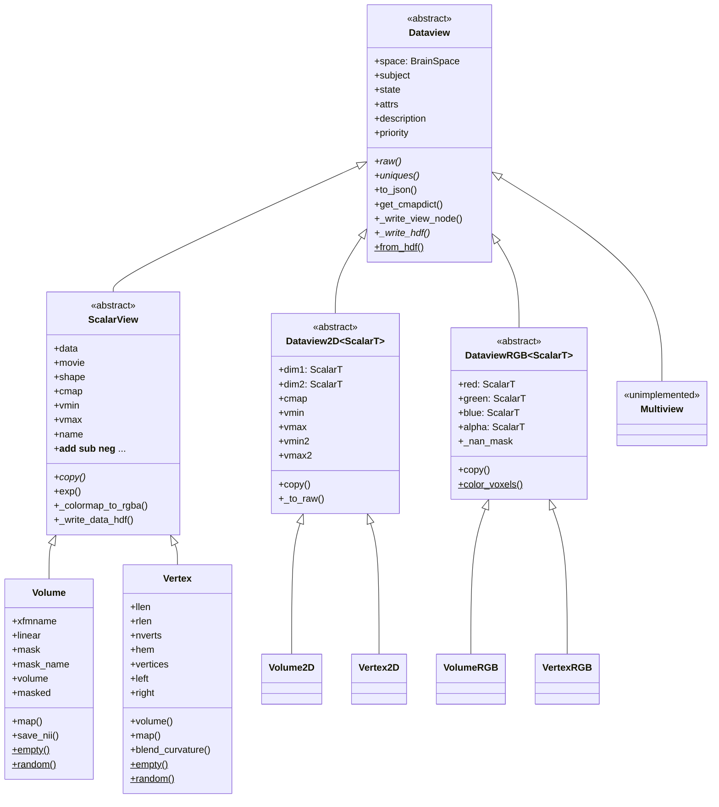
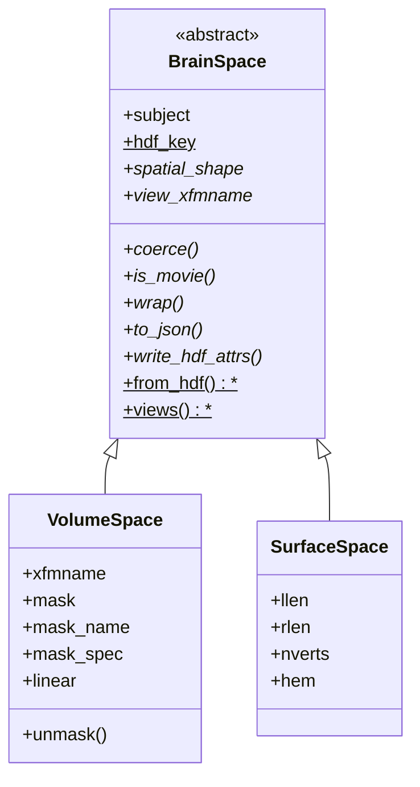

# `cortex.dataset` class hierarchy

Reference for the `Dataview` object graph. See
[TYPING_ALTERNATIVES.md](TYPING_ALTERNATIVES.md) for the restructuring options that
were considered and why this one was chosen.

## Two axes, two mechanisms

The six public classes are a 2x3 grid: two **spaces** crossed with three **channel
layouts**. The two axes are deliberately given different mechanisms.

|  | scalar (1 channel + 1D cmap) | 2D (2 channels + 2D cmap) | RGB (3 channels + alpha) |
| --- | --- | --- | --- |
| **volumetric** | `Volume` | `Volume2D` | `VolumeRGB` |
| **surface** | `Vertex` | `Vertex2D` | `VertexRGB` |
| *abstract base* | `ScalarView` | `Dataview2D` | `DataviewRGB` |

- **Channel layout is the inheritance axis.** All the shared logic -- colormapping,
  HDF, JSON, NaN handling, alpha -- lives in the three abstract bases.
- **Space is a component**, `view.space`, described by a `BrainSpace`. This is the
  open axis: adding a new kind of brain data means adding a space, not
  reimplementing the three bases.

There is no multiple inheritance anywhere. `BrainData` and `Dataview` used to be
unrelated base classes joined only by MI in `Volume` and `Vertex`, and that MI was
load-bearing: `BrainData.to_json` and `VolumeData.copy` called `super()` methods
that existed nowhere in their own ancestry, resolving only because `Volume`'s MRO
threaded through `Dataview`.





Source locations:

| Class | Location |
| --- | --- |
| `Dataview`, `ScalarView`, `Volume`, `Vertex`, `Multiview`, `_masker` | `views.py` |
| `Dataview2D`, `Volume2D`, `Vertex2D` | `view2D.py` |
| `DataviewRGB`, `VolumeRGB`, `VertexRGB`, `Colors` | `viewRGB.py` |
| `BrainSpace`, `VolumeSpace`, `SurfaceSpace`, the space registry | `_space.py` |
| `Dataset` | `dataset.py` |
| `_hash`, `_hdf_write`, `_find_mask` | `_hdf.py` |
| union aliases and `TypeIs` helpers | `_typing.py` |

`braindata.py` is a compatibility shim: `BrainData`, `VolumeData` and `VertexData`
are aliases for `ScalarView`, `Volume` and `Vertex`. The aliases preserve
`isinstance` exactly -- `isinstance(x, VolumeData)` was only ever true for
`Volume`, since `Volume2D` and `VolumeRGB` never inherited it. Two module paths are
pinned by external code and still resolve: `cortex.dataset.views.Vertex`
(`cortex/database.py`) and `dataset.braindata.VertexData` (`cortex/blender/`).

## Generics: one covariant TypeVar

`Dataview2D` and `DataviewRGB` are generic in their channel type:

```python
ScalarT = TypeVar("ScalarT", bound=ScalarView, covariant=True)

class Volume2D(Dataview2D[Volume]): ...
class VolumeRGB(DataviewRGB[Volume]): ...
```

So `Volume2D.dim1` is a `Volume` and `VertexRGB.alpha` is a `Vertex` without either
class re-declaring anything. That last one is why the TypeVar earns its keep: **a
property's return type cannot be narrowed by re-annotation, only by re-implementing
the property.** `alpha` used to exist twice, ~25 near-identical lines in each RGB
class, purely because of that.

Covariance is sound here because the channels are read-only properties backed by
private fields, set once in `__init__`. It buys off the usual generics tax:
`Dataview2D[ScalarView]` accepts a `Volume2D`, which an invariant parameter would
reject.

Two limits worth knowing rather than discovering:

- mypy allows a covariant TypeVar in `__init__` parameters and in return position,
  but **not in ordinary method parameters**. The `alpha` setter therefore takes the
  base `ChannelLike`, not `ScalarT`.
- `isinstance(x, DataviewRGB[Volume])` is a runtime `TypeError`. Unsubscripted works
  and narrows to `DataviewRGB[Any]`, which is what the back-compat aliases rely on.

Narrowing a **bare annotation** in a subclass is accepted by mypy; narrowing an
**assigned** ClassVar is not. That asymmetry is why `space` is exposed as a
read-only property over a narrowed private `_space`, and it is exactly what made
the old `_cls` untypeable.

One thing the type system cannot express here: nothing stops
`DataviewRGB[Vertex]` from being declared with a `VolumeSpace`. Tying the space to
the channel would need higher-kinded types, so it stays a runtime constructor
check.

## Adding a new kind of brain data

Four declarations. The three bases supply everything else.

```python
@register_space
class MySpace(BrainSpace):
    hdf_key = "myspace"
    def coerce(self, data): ...           # validate; record per-array geometry
    def is_movie(self, data): ...         # does it have a leading time axis
    @property
    def spatial_shape(self): ...
    def wrap(self, data, **kw): ...       # build a MyView over `data`
    def to_json(self): ...
    def write_hdf_attrs(self, h5, node): ...
    @property
    def view_xfmname(self): ...           # slot 7 of the /views record
    @classmethod
    def from_hdf(cls, attrs, *, subject, xfmname, mask): ...
    @classmethod
    def views(cls):
        return SpaceViews(scalar=MyView, twod=MyView2D, rgb=MyViewRGB)

class MyView(ScalarView): ...             # + space-specific accessors
class MyView2D(Dataview2D[MyView]): ...   # + a constructor forwarding space kwargs
class MyViewRGB(DataviewRGB[MyView]): ...
```

`register_space` puts it in the registry that `_from_hdf_data`, `_from_hdf_view`
and `normalize` dispatch through, so HDF round-tripping needs no edits. Order
matters: the registry is consulted in registration order and the first space whose
`from_hdf` returns non-`None` wins. `SurfaceSpace` is deliberately last, because it
accepts anything without a transform -- that is how legacy files, which carry no
space discriminator, are detected. A new space should test for something it writes
itself in `write_hdf_attrs`, and will be consulted ahead of the built-ins.

`space.wrap()` is the abstraction that keeps the rest space-agnostic: the channel
resolvers in `view2D.py` and `viewRGB.py`, and all three HDF factories, build views
through it and never name `Volume` or `Vertex`. A space is per-view, not shared:
`coerce()` records facts that depend on the particular array bound to it (which
mask a flattened array matches, which hemisphere a half-length array covered), so
`wrap()` uses `self` only as a template of parameters.

## Narrowing the grid

`_typing.py` gives consumers both a closed and an open test.

```python
from cortex.dataset import is_volume_view, is_colormapped, space_of, VolumeSpace

if is_volume_view(view):                       # narrows to Volume|Volume2D|VolumeRGB
    ...
if isinstance(space_of(view), VolumeSpace):    # also true for spaces added later
    ...
```

The unions are closed over the built-ins and cannot cover a space that did not
exist when they were written; `view.space` can.

`TypeIs` (PEP 742), not `TypeGuard` (PEP 647). `TypeGuard` narrows the positive
branch only, so the `else` of a volume/surface fork kept the full six-member union
and every attribute access in it had to be re-guarded. `TypeIs` subtracts, which
is what these predicates want -- each narrows to a subtype of its parameter, which
is exactly `TypeIs`'s domain. Measured on the real fork in `make_flatmap_image`:

| | mypy errors |
| --- | --- |
| loose signature + `TypeGuard` | 3 |
| tightened signature + `TypeGuard` | 5 (worse -- the union stops collapsing into `Dataview`) |
| tightened signature + `TypeIs` | 0 |

The two only pay off together: `TypeIs` with an `Any` parameter gains nothing,
since subtracting from `Any` yields `Any`.

That is why the predicates take `BuiltinView` rather than `Any`, and why code
holding a bare `Dataview` converts once with `as_builtin_view()`. `TypeIs` is
imported under `TYPE_CHECKING`: it only reached the standard library in 3.13 and
this package supports 3.10, but `from __future__ import annotations` means the
annotation is never evaluated at runtime, so `typing_extensions` stays a
`python_version < '3.11'` dependency instead of becoming unconditional. The one
consequence is that `typing.get_type_hints()` on these predicates raises
`NameError`; nothing in pycortex or its docs build calls it on them.

`is_colormapped` exists rather than just `is_scalar_view` because the test it
replaced, `hasattr(braindata, "cmap")`, matched 2D views as well as scalar ones.

Only the *rows* of the grid get union aliases (`VolumeLike`, `VertexLike`, and
`BuiltinView` for both). The columns are already classes -- `ScalarView`,
`Dataview2D[Any]`, `DataviewRGB[Any]` -- so the predicates spell their column
unions inline rather than naming them twice.

## The wire format is a hard interface

`webgl/resources/js/dataset.js` dispatches **structurally**; no Python class name
reaches the browser.

| JS test | Meaning |
| --- | --- |
| `mosaic === undefined` | surface data |
| `json.data[i] instanceof Array` | 2D view |
| `json.raw` | RGB, 4-channel uint8 texture path |
| `json.vmin[0] instanceof Array` | 2D ranges |

`module.makeFrom(dvx, dvy)` also synthesizes a 2D view client-side. The eight-slot
`/views` record and the `to_json` key shapes must therefore be preserved exactly,
including the `"null"` written into slots 2-4 for RGB views. Any change here should
be checked by diffing the saved HDF and `to_json()` output before and after: a
shape change breaks the viewer silently rather than noisily.

Slot layout, written by `Dataview._write_view_node`:

| Slot | Contents |
| --- | --- |
| 0 | data node name(s); a nested list means a 2D or RGB view |
| 1 | description |
| 2 | `[cmap]`, or `"null"` for RGB |
| 3 | `[vmin]`, or `[[vmin, vmin2]]` for 2D, or `"null"` for RGB |
| 4 | `[vmax]`, likewise |
| 5 | state |
| 6 | attrs |
| 7 | `space.view_xfmname` -- `[xfmname]` for volumes, `null` for surfaces |

An RGB view built with `alpha=None` writes `null` in the alpha position of slot 0
rather than a synthesized fully-opaque channel, which is what makes
`_from_hdf_view`'s `data[3] is not None` branch reachable.

## Numerics note

`ScalarView._resolve_percentiles` keeps `np.percentile`'s `np.float64` rather than
converting to a Python `float`. Under NEP 50 a numpy scalar is a *strong* operand,
so `float32_channel -= vmin` computes in float64 and rounds once, where a weak
Python float computes in float32. The difference is a single LSB on a handful of
voxels -- but channel names are content hashes, so it silently changes on-disk node
identity. `np.float64` subclasses `float`, so the annotation still holds.

## Known bug: `mapper.py`

`Mapper.__call__` does:

```python
if isinstance(data, dataset.Vertex):
    llen = self.masks[0].shape[0]
    if data.raw:                       # <-- always truthy
        left, right = data.data[..., :llen, :], data.data[..., llen:, :]
    else:
        left, right = data[..., :llen], data[..., llen:]
```

`Vertex.raw` is a property that builds and returns a `VertexRGB`, so it is always
truthy and the `else` branch is dead. Every scalar `Vertex` takes the RGB path,
which indexes as if the data had a trailing channel axis. This looks like a
leftover from a time when `raw` was a boolean flag.

Not fixed here, because correcting it changes runtime behaviour and needs a
regression test. It is now visible to mypy: `Vertex.__getitem__` returns `Self`
rather than `Any`, so the checker reports that the dead branch yields `Vertex`
objects where arrays are expected.

## Other known issues, outside this package

- `quickflat/composite.py` reads `dataview.xfmname` then tests `if xfmname is None`
  to emit a "you seem to have provided vertex data" message -- but `Vertex` has no
  `xfmname`, so it raises `AttributeError` before reaching the intended
  `ValueError`.
- `quickflat/view.py` reads `dataview.xfmname` unguarded on the `with_dropout` path.
- `webgl/view.py`'s `JSMixer.addData` references `Dataset` and `_convert_dataset`,
  neither of which exists; it is permanently broken and xfailed.
- `volume.py`'s `epi2anatspace_fsl` calls `normalize(...).data` then `.subject` on
  the resulting array. Unreachable -- the function raises `NotImplementedError`
  first.
- `Dataview2D.to_json` ignores its `simple` flag. Preserved deliberately: the webgl
  packer only ever calls `to_json(simple=True)` on the scalar channels yielded by
  `uniques()`, never on a 2D view.
- `Database.get_cache` builds its hash from `auxfile.h5.filename`; `md5` needs
  bytes, so this raised an uncaught `TypeError` until it was given an `.encode()`.
