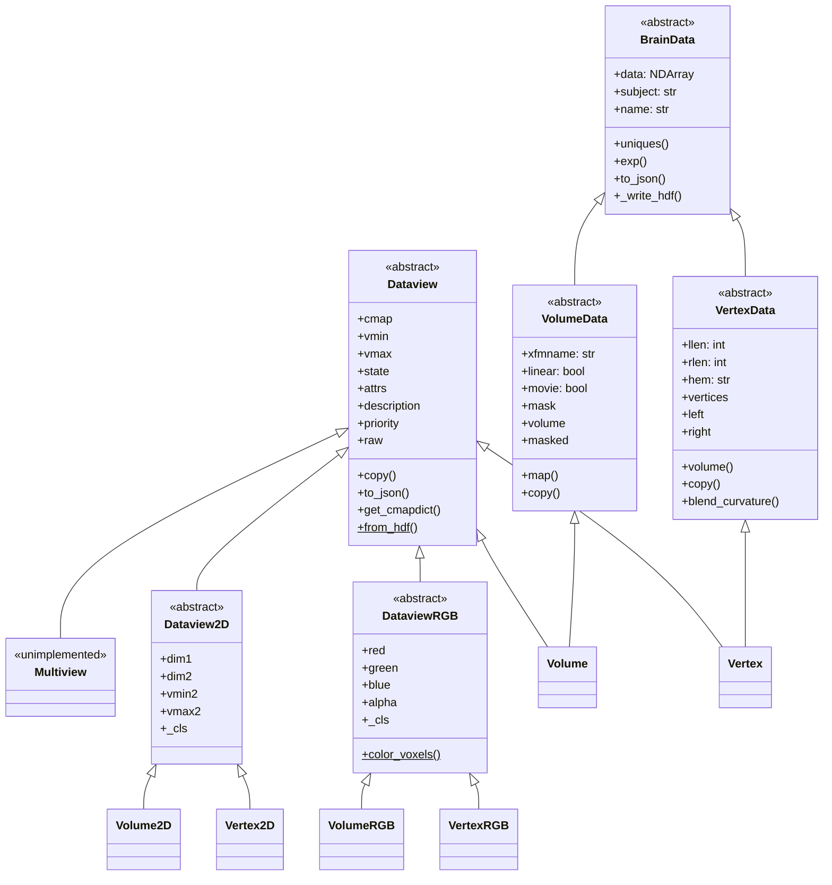
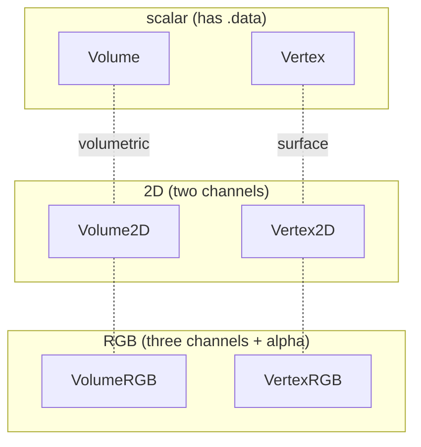
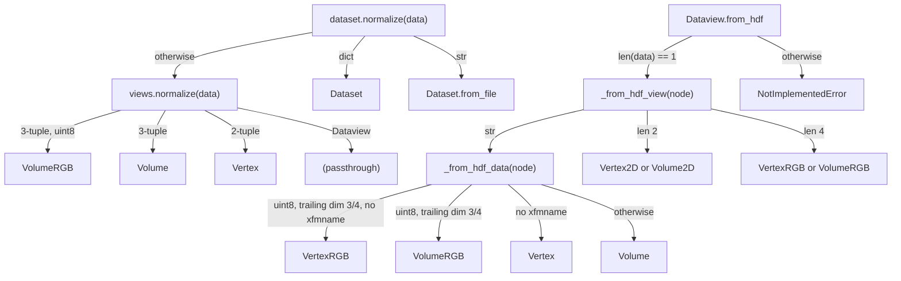

# `cortex.dataset` class hierarchy

Reference for the `Dataview` / `BrainData` object graph, written while adding type
annotations to the package. See [TYPING_ALTERNATIVES.md](TYPING_ALTERNATIVES.md) for
restructuring options that were considered and deferred.

## The class graph

Two unrelated base classes, `BrainData` and `Dataview`, are joined only by multiple
inheritance in the two concrete scalar views, `Volume` and `Vertex`.



Source locations:

| Class | Location | Bases |
| --- | --- | --- |
| `BrainData` | `braindata.py:26` | — |
| `VolumeData` | `braindata.py:136` | `BrainData` |
| `VertexData` | `braindata.py:379` | `BrainData` |
| `Dataview` | `views.py:203` | — |
| `Multiview` | `views.py:408` | `Dataview` |
| `Volume` | `views.py:422` | `VolumeData`, `Dataview` |
| `Vertex` | `views.py:524` | `VertexData`, `Dataview` |
| `Dataview2D` | `view2D.py:15` | `Dataview` |
| `Volume2D` | `view2D.py:116` | `Dataview2D` |
| `Vertex2D` | `view2D.py:214` | `Dataview2D` |
| `DataviewRGB` | `viewRGB.py:79` | `Dataview` |
| `VolumeRGB` | `viewRGB.py:370` | `DataviewRGB` |
| `VertexRGB` | `viewRGB.py:673` | `DataviewRGB` |
| `Dataset` | `dataset.py:17` | — |
| `Colors` | `viewRGB.py:26` | — |
| `_masker` | `braindata.py:705` | `Generic[T_masker]` |

`Multiview` is dead code: `Multiview.__init__` raises `NotImplementedError` before its only
assignment (`views.py:413-414`).

## The MRO, and why it matters

`BrainData` declares no base class, but `BrainData.__init__` calls `super().__init__(**kwargs)`
(`braindata.py:53`) and `BrainData.to_json` calls `super().to_json(...)` (`braindata.py:103`).
Those calls only resolve because of the multiple inheritance in `Volume`/`Vertex`:


So `BrainData.to_json`'s `super()` lands on `Dataview.to_json`. Read on its own, `BrainData`
appears to call a method that does not exist anywhere in its ancestry. The same applies to
`VolumeData.copy` (`braindata.py:311`) and `VertexData.copy` (`braindata.py:491`), whose
`super().copy(...)` reaches `Dataview.copy` (`views.py:239`); and to `Volume.raw`
(`views.py:509`) and `Vertex.raw` (`views.py:595`), whose `super().raw` reaches
`Dataview.raw`.

This is the central difficulty for a static type checker. Before the annotation pass,
`Dataview.raw` carried a TODO saying exactly this:

> `# TODO: self.data relies on BrainData. Would need common inheritance for this to work.`

It has been replaced by a `cast` to `ScalarDataview` and an explanatory comment
(`views.py:395-397`), but the underlying gap is unchanged -- see
[TYPING_ALTERNATIVES.md](TYPING_ALTERNATIVES.md) option B for the "common inheritance" the
TODO was asking for. Three other comments record the same gap: `dataset.py:23` (*"should be
BrainData & Dataview, or just Dataview"*), `braindata.py:705` (*"should be braindata +
dataview"*), and `views.py:196` (*"is this actually from BrainData?"*).

## The 2x3 grid the class names imply

The concrete classes form a grid, but only its columns exist as classes. There is no type
meaning "any volumetric view". Consumers used to fall back on duck-typing for this
(`if not hasattr(braindata, "xfmname")` in `../quickflat/utils.py`), which no type checker
can narrow; they now use the `TypeIs` helpers described below.



|  | scalar | 2D | RGB |
| --- | --- | --- | --- |
| **volumetric** — has `xfmname`, `.volume` | `Volume` | `Volume2D` | `VolumeRGB` |
| **surface** — has `.vertices`, `.left`/`.right` | `Vertex` | `Vertex2D` | `VertexRGB` |
| | *base class* `Dataview` | `Dataview2D` | `DataviewRGB` |

The row axis is expressed in `_typing.py` as the `VolumeLike` / `VertexLike` unions plus the
`is_volume_view` / `is_vertex_view` narrowing helpers.

## Factories and runtime dispatch

Several functions return a class chosen at runtime. These are the hardest parts of the
package to type precisely.



| Factory | Location | Declared return | Notes |
| --- | --- | --- | --- |
| `views.normalize` | `views.py:42` | overloaded | The uint8 3-tuple branch (`views.py:58`) returns `VolumeRGB`; the overloads distinguish only by tuple length, so this branch is not expressible. |
| `dataset.normalize` | `dataset.py:247` | overloaded | The `tuple` overload (`dataset.py:254`) says `Vertex | Volume` but delegates to `views.normalize`, which can also return `VolumeRGB`. |
| `_from_hdf_data` | `views.py:72` | unannotated | Four possible classes. Filters kwargs to `description`/`state`/`priority` on the RGB path because RGB constructors take no `cmap`/`vmin`/`vmax`. |
| `_from_hdf_view` | `views.py:133` | unannotated | Binds `cls` to a class object at runtime (`views.py:145`, `:164`) and calls it with kwargs that differ between the candidates. |
| `Dataview.from_hdf` | `views.py:291` | unannotated | Builds `views` then unconditionally raises (`views.py:330-335`); that code is dead but still executed. |
| `VolumeData.empty` / `.random` | `braindata.py:182` / `:209` | `Self` | Genuine `cls(...)` factories. |
| `VertexData.empty` / `.random` | `braindata.py:408` / `:435` | unannotated | Same, unannotated. |
| `Dataset.from_file` | `dataset.py:73` | `Dataset` | Populates `views` from both `_from_hdf_data` and `Dataview.from_hdf`; sets the global `db.auxfile` as a side channel (`dataset.py:95`, `:117`). |

## Conditional attributes

Members that exist only on some code paths. Each is a place where a checker cannot assume
presence, and where `hasattr` / `try: ... except AttributeError` appears at runtime.

| Attribute | Present when | Set at |
| --- | --- | --- |
| `VolumeData.mask` | only when `self.linear` | `braindata.py:254`, `:259`; the `else` branch at `:238` never assigns it |
| `VolumeData._mask` | always, but is `str` when auto-found or named, `NDArray[bool]` when passed as an array, `None` otherwise | `braindata.py:254-264` |
| `Dataview._nan_mask` | only on RGB views built by `Volume.raw` / `Vertex.raw` | declared `views.py:204`, assigned only `views.py:517`, `:604`; read via `getattr(..., None)` at `viewRGB.py:123` |
| `cmap`, `vmin`, `vmax` | **absent on all RGB views** — `DataviewRGB.__init__` never calls `Dataview.__init__` | `views.py:229-231`; the absence drives `except AttributeError` at `views.py:282` and `:345` |
| `VertexData.hem` | always, one of `"left"`, `"right"`, `"both"` | `braindata.py:475`, `:481`, `:487` |
| `attrs["priority"]` | defaulted only if absent | `views.py:234`, `view2D.py:36`, `viewRGB.py:94` |
| `Dataset.h5` | `None` unless loaded from file | `dataset.py:26`, set at `dataset.py:73`; indexed without a `None` check at `dataset.py:190`, `:204`, `:212`, `:220` |

## Typing hazards

Constructs in this package that static analysis cannot follow.

- **Dynamic operator injection.** `BrainData._add_numpy_methods` (`braindata.py:113-132`),
  invoked at import time (`braindata.py:134`), `setattr`s nine dunders
  (`__add__`, `__sub__`, `__mul__`, `__floordiv__`, `__truediv__`, `__div__`, `__pow__`,
  `__neg__`, `__abs__`). `vol + 1` is therefore unresolvable statically. Note also that
  `__neg__` and `__abs__` are generated with the same binary `*args` signature as the rest.
- **`Dataset.__getattr__`** (`dataset.py:48`) returns `self.views[attr]` for any name, so
  every attribute access on a `Dataset` type-checks, including typos.
- **`_cls` unbound dispatch.** `DataviewRGB._cls` (`viewRGB.py:82`) and the `Dataview2D`
  subclasses' `_cls` (`view2D.py:152`, `:247`) hold a class object that is then called
  unbound: `self._cls._write_hdf(self.red, h5)` (`viewRGB.py:132`), `view2D.py:45`. This is
  deliberate — it calls the `VolumeData` implementation, skipping the `Dataview` half that
  `Volume._write_hdf` would add. `Dataview2D` uses `_cls` without declaring it.
- **`blend_curvature = VertexData.blend_curvature`** (`view2D.py:248`, `viewRGB.py:742`,
  both commented *"hacky inheritance"*) copies an unbound `VertexData` method onto classes
  that are not `VertexData`. These used to read `_cls.blend_curvature`; they now name
  `VertexData` directly, since `_cls` is declared `type[BrainData]`, which has no such
  method. Same object at runtime.
- **`raw` has two incompatible meanings.** `Dataview.raw` (`views.py:382`) returns
  `tuple[NDArray[uint8], NDArray[bool]]`, but all six concrete subclasses override it to
  return an RGB *object*: `views.py:504`, `:591`, `view2D.py:190`, `:282`, `viewRGB.py:669`,
  `:941`. The tuple form is really a private helper consumed via `super().raw`.
- **`volume` is a property on one class and a method on another.** `VolumeData.volume`
  (`braindata.py:319`) and `VolumeRGB.volume` (`viewRGB.py:624`) are properties;
  `VertexData.volume(xfmname, ...)` (`braindata.py:503`) is a method.
- **`left` / `right` mean different things.** `VertexData.left`/`right`
  (`braindata.py:574`, `:583`) slice the raw data; `VertexRGB.left`/`right`
  (`viewRGB.py:922`, `:926`) slice uint8 RGBA and have a different shape.
- **`alpha` getter and setter disagree.** `VolumeRGB.alpha` returns `Volume`
  (`viewRGB.py:581`) but accepts `Optional[NDArray | Volume]` (`viewRGB.py:605`); same for
  `VertexRGB` (`viewRGB.py:859`, `:883`).
- **Attribute narrowing in subclasses.** `dim1`/`dim2` are declared `Dataview`
  (`view2D.py:22-23`) and narrowed to `Volume`/`Vertex` (`view2D.py:153`, `:249`);
  `red`/`green`/`blue` likewise (`viewRGB.py:83-85` narrowed at `:442`, `:743`).
- **`Dataview2D.__init__` does not call `super().__init__()`** — it duplicates the
  `Dataview.__init__` body (`view2D.py:28-38`), which also means it skips the
  direct-instantiation guard at `views.py:226`.
- **`DataviewRGB.__init__` reads `self.red` before assigning it** (`viewRGB.py:93`); the
  subclass constructors assign the channels first and then call `super().__init__()`
  (`viewRGB.py:577`, `:855`).
- **Circular imports resolved at the bottom of the file.** `views.py:664-665` imports
  `viewRGB` and `view2D` after the class bodies that annotate with `VolumeRGB`/`VertexRGB`;
  this works only because of `from __future__ import annotations` at `views.py:1`.

## Known bug: `mapper.py:65`

`Mapper.__call__` (`../mapper/mapper.py:60`) does:

```python
if isinstance(data, dataset.Vertex):
    llen = self.masks[0].shape[0]
    if data.raw:                       # <-- always truthy
        left, right = data.data[..., :llen, :], data.data[..., llen:, :]
    else:
        left, right = data[..., :llen], data[..., llen:]
```

`Vertex.raw` (`views.py:591`) is a property that builds and returns a `VertexRGB`, so it is
always truthy and the `else` branch is dead code. Every scalar `Vertex` takes the RGB path,
which indexes as if the data had a trailing channel axis. This looks like a leftover from a
time when `raw` was a boolean flag. Not fixed here, since correcting it changes runtime
behaviour and needs a regression test.

## Changes made by the type-annotation pass

The annotations were added type-only: no class was added, removed or reparented, and the
graph above is the current one. Four incidental code changes were made where an expression
could not be typed as written, none of which alter behaviour on the paths they guard:

- `DataviewRGB._apply_nan_mask` used `hasattr(alpha, "volume")` to mean "is a volume".
  Because `volume` is a property on `Volume` but a *method* on `Vertex`, that test was true
  for both, and `alpha.volume.shape` would have raised `AttributeError` on a `Vertex`. It
  now uses `isinstance(alpha, Volume)`.
- `Volume2D.__init__` and `Vertex2D.__init__` tested `isinstance(dim1, self._cls)`. A
  checker cannot narrow against a variable class, so these now name `VolumeData` /
  `VertexData` directly -- which is what `Vertex2D` already did for its first argument.
- `blend_curvature` is copied from `VertexData` by name rather than through `_cls`.
- `_cls` is declared `ClassVar[type[BrainData]]`, including on `Dataview2D`, which used it
  in `_write_hdf` without declaring it.

`_typing.py` adds the `VolumeLike` / `VertexLike` / `ScalarDataview` aliases and the
`is_volume_view` / `is_vertex_view` / `is_rgb_view` / `is_scalar_view` narrowing helpers.
`ScalarDataview` (`Volume | Vertex`) is the stand-in for the `BrainData & Dataview`
intersection that several comments in this package ask for.
