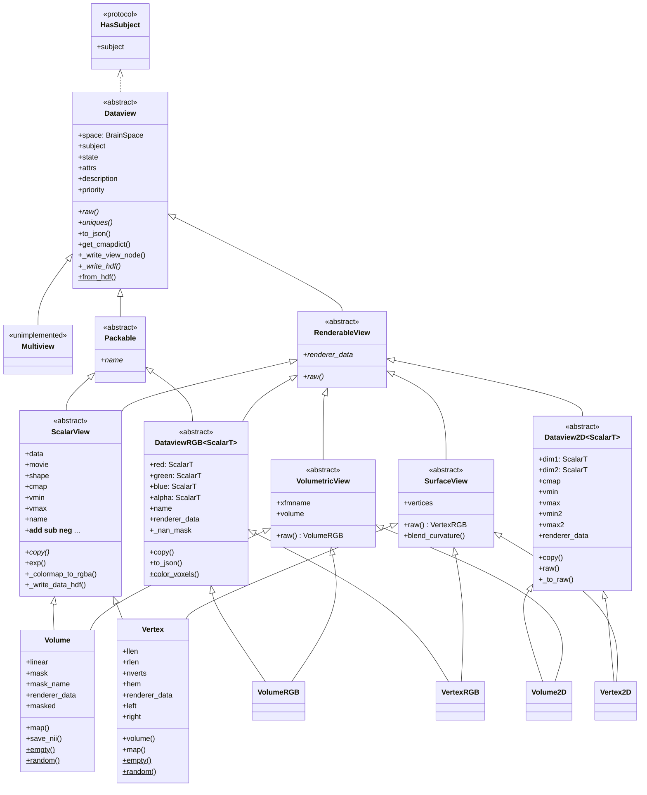
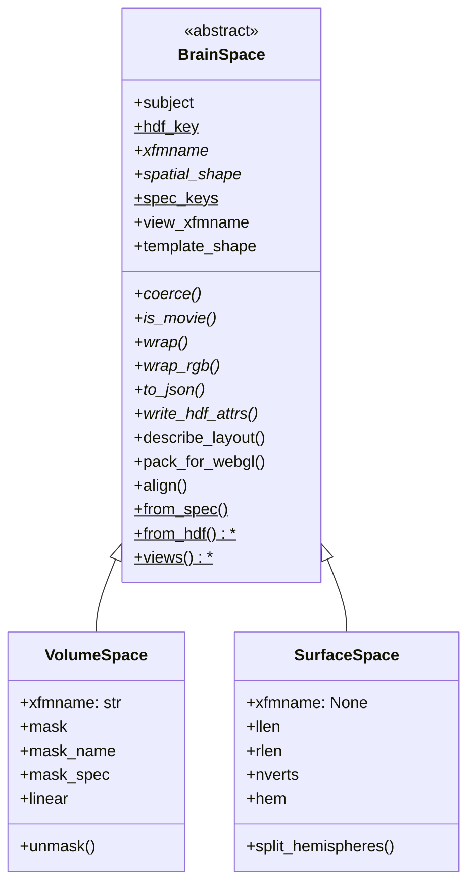

# `cortex.dataset` class hierarchy

Reference for the `Dataview` object graph: what the classes are, how they relate,
and which of those relations are load-bearing. Three companion documents cover the
questions this one deliberately does not:

| | |
| --- | --- |
| [ADDING_A_SPACE.md](ADDING_A_SPACE.md) | how to add a new kind of brain data |
| [TYPING_ALTERNATIVES.md](TYPING_ALTERNATIVES.md) | the restructuring options considered, and why this one |
| [KNOWN_ISSUES.md](KNOWN_ISSUES.md) | bugs this package has, and had |

## Two axes, two mechanisms

The six public classes are a 2x3 grid: two **spaces** crossed with three **channel
layouts**. The two axes are deliberately given different mechanisms.

|  | scalar (1 channel + 1D cmap) | 2D (2 channels + 2D cmap) | RGB (3 channels + alpha) |
| --- | --- | --- | --- |
| **volumetric** | `Volume` | `Volume2D` | `VolumeRGB` |
| **surface** | `Vertex` | `Vertex2D` | `VertexRGB` |
| *abstract base* | `ScalarView` | `Dataview2D` | `DataviewRGB` |

- **Channel layout is the inheritance axis.** All the shared logic -- colormapping,
  HDF, JSON, NaN handling, alpha -- lives in the three abstract bases.
- **Space is a component**, `view.space`, described by a `BrainSpace`. This is the
  open axis: adding a new kind of brain data means adding a space, not
  reimplementing the three bases.

Each concrete class has exactly two bases: its column, which carries all the state
and behaviour, and its spatial interface, which is stateless. That is not the
multiple inheritance this package was restructured to remove. `BrainData` and
`Dataview` used to be unrelated base classes joined only by MI in `Volume` and
`Vertex`, and that MI was load-bearing: `BrainData.to_json` and `VolumeData.copy`
called `super()` methods that existed nowhere in their own ancestry, resolving
only because `Volume`'s MRO threaded through `Dataview`. The spatial interfaces have no
`__init__`, no attributes and no cooperative `super()` chain, so nothing depends
on how they linearize. See [Narrowing the grid](#narrowing-the-grid).



Each concrete class reads down two edges: its column (left) and its spatial
interface (right).
`blend_curvature` is drawn on `SurfaceView` because that is the only place it is
defined; `Vertex` inherits it rather than declaring its own.

### `Packable`: the unit of transport

`Packable` is what `uniques()` yields: a view that ships as exactly one array. It
**subclasses `RenderableView`**, so the two questions are nested rather than
independent:

| base | question | who has it |
| --- | --- | --- |
| `RenderableView` | "can a renderer **sample** this?" | all three columns |
| `Packable` | "...and is it **one addressable array**?" | scalar and RGB columns |

The containment is strict, and the strictness is the whole content: a 2D view is
renderable and **not** packable, because it owns no array of its own -- only the
two channels it decomposes into -- which is exactly why it has no `name`.

It is a subclass rather than a sibling because `webgl.data.Package` reads *two*
members off each unique: `name`, to key it by, and `renderer_data`, to ship.
Promising only `Packable` promised half of what the one consumer needs, and
Python has no intersection type, so the way to say "both" is for one base to
subclass the other. Every `Packable` was already a `RenderableView` in fact --
both columns list both bases -- so this only writes it down. Pinned by
`test_a_packable_is_renderable_so_uniques_promises_both_members`, which also pins
that the MRO is unchanged by saying it: the column still precedes the spatial
interface, which is what lets the column own `renderer_data`.

The one member is `name`, a content hash. That is what makes `Dataset.uniques()` a
`set` rather than a list -- two views over identical data collapse to one entry and
are stored and shipped once.

`uniques()` was annotated `Iterator[Dataview]`, which is wider than the truth and
lacks the one member every consumer reaches for first. `webgl.data.Package`
type-checked only because the list it built was `Any`; nothing warned that
`Dataview` has no `name`.

**Do not hoist `name` onto the spatial interface.** `VolumeRGB.name` and `VertexRGB.name` are both
exactly `_hash(self.renderer_data)`, which makes a single definition on
`RenderableView` look free. It is not: `ScalarView.name` hashes the *stored* array,
and for a masked `Volume` that is the flat masked array, not the unmasked 3-D
`renderer_data`. Unifying them silently renames every existing HDF node. Pinned by
`test_packable_name_is_not_hoisted_onto_the_spatial_interface`.

What *did* collapse is the two RGB definitions into one on `DataviewRGB`, since for
an RGB view the stored array *is* the sampled one, and its `name` is only ever a
browser key -- its channels are what become HDF nodes, each under its own name.
That needed `DataviewRGB` to see a spatial-interface member, which is why all three
column classes now list `RenderableView` among their bases: every concrete view is
renderable, so saying it on the column is what lets a helper that reads "the array"
live once there instead of twice in its volumetric and surface halves.

What `name` addresses is also asymmetric, which is why `Packable` promises only the
name and not what it hashes: for a scalar view it is both the HDF node name and the
browser key, whereas an RGB view writes its channels as four separate HDF nodes and
uses its own `name` only as the browser key.



Source locations:

| Class | Location |
| --- | --- |
| `Dataview`, `ScalarView`, `Volume`, `Vertex`, `Multiview`, `_masker` | `views.py` |
| `HasSubject`, `Packable`, `RenderableView`, `VolumetricView`, `SurfaceView` | `views.py` |
| `as_renderable`, `normalize`, `_detect_space`, `_from_hdf_data` | `views.py` |
| `Dataview2D`, `Volume2D`, `Vertex2D` | `view2D.py` |
| `DataviewRGB`, `VolumeRGB`, `VertexRGB`, `Colors` | `viewRGB.py` |
| `BrainSpace`, `VolumeSpace`, `SurfaceSpace`, the space registry | `_space.py` |
| `WebGLPayload`, `MosaicTexture`, `VertexAttributes`, `pack_png` | `_webgl.py` |
| `Dataset` | `dataset.py` |
| `_hash`, `_hdf_write`, `_find_mask` | `_hdf.py` |

Everything naming the grid lives in `views.py`, next to the classes it names:
there was a `_typing.py` holding the spatial ABCs' aliases and the boundary helper,
but once they became real classes it had nothing left to work around, and its last
occupant -- `as_renderable` -- belongs beside `RenderableView` anyway.
`cortex/dataset/__init__.py` must import `.views`
first — it resolves its circular dependency on `view2D`/`viewRGB` with deferred
imports at the bottom of its own module, so anything reaching those earlier sees a
partially initialised module. A test pins the import order.

`braindata.py` is a compatibility shim: `BrainData`, `VolumeData` and `VertexData`
are aliases for `ScalarView`, `Volume` and `Vertex`. The aliases preserve
`isinstance` exactly -- `isinstance(x, VolumeData)` was only ever true for
`Volume`, since `Volume2D` and `VolumeRGB` never inherited it.

Nothing inside the package reaches through `braindata` any more. `cortex/blender/`
used to (`isinstance(braindata, dataset.braindata.VertexData)`) and now tests
`dataset.Vertex` directly; what remains are `cortex/tests/test_braindata.py`, which
imports `_hash` from there, and `test_dataset.py`, which imports the three aliases
precisely to keep this shim honest. It is kept for code outside the repo. One
submodule path is still pinned internally and must keep resolving:
`cortex.dataset.views.Vertex`, imported by `cortex/database.py`.

## Generics: one covariant TypeVar

`Dataview2D` and `DataviewRGB` are generic in their channel type:

```python
ScalarT = TypeVar("ScalarT", bound=ScalarView, covariant=True)

class Volume2D(Dataview2D[Volume]): ...
class VolumeRGB(DataviewRGB[Volume]): ...
```

So `Volume2D.dim1` is a `Volume` and `VertexRGB.alpha` is a `Vertex` without either
class re-declaring anything. That last one is why the TypeVar earns its keep: **a
property's return type cannot be narrowed by re-annotation, only by re-implementing
the property.** `alpha` used to exist twice, ~25 near-identical lines in each RGB
class, purely because of that.

Covariance is sound here because the channels are read-only properties backed by
private fields, set once in `__init__`. It buys off the usual generics tax:
`Dataview2D[ScalarView]` accepts a `Volume2D`, which an invariant parameter would
reject.

Two limits worth knowing rather than discovering:

- mypy allows a covariant TypeVar in `__init__` parameters and in return position,
  but **not in ordinary method parameters**. The `alpha` setter therefore takes the
  base `ChannelLike`, not `ScalarT`.
- `isinstance(x, DataviewRGB[Volume])` is a runtime `TypeError`. Unsubscripted works
  and narrows to `DataviewRGB[Any]`, which is what the back-compat aliases rely on.

Narrowing a **bare annotation** in a subclass is accepted by mypy; narrowing an
**assigned** ClassVar is not. That asymmetry is why `space` is exposed as a
read-only property over a narrowed private `_space`, and it is exactly what made
the old `_cls` untypeable.

One thing the type system cannot express here: nothing stops
`DataviewRGB[Vertex]` from being declared with a `VolumeSpace`. Tying the space to
the channel would need higher-kinded types, so it stays a runtime constructor
check.

### Where per-space narrowing has to live

`space` is typed `BrainSpace` on all three columns, so a composite view that reads
a space-specific member off it narrows `space` itself. `VertexRGB` does, for
`left`/`right`, which need `SurfaceSpace.split_hemispheres`; `VolumeRGB` does not,
because nothing in it reads a `VolumeSpace` member off `self.space` -- it gets
`xfmname` from `VolumetricView`. The body is identical to the base's
(`return self.red.space`), so the override buys nothing at runtime: it exists only
to state the type.

Two places it cannot go instead, both worth knowing before trying:

- **Not on the spatial interface.** `SurfaceView.space -> SurfaceSpace` looks
  right -- the interface knows its space kind -- but the column precedes the
  interface in every MRO, so the column's wider declaration wins and the narrowing
  is dead. mypy does not merely ignore it either; it reports
  `Definition of "space" in base class "DataviewRGB" is incompatible with
  definition in base class "SurfaceView"`. Listing the interface first narrows
  correctly and then breaks at runtime, since only the column knows where the
  space comes from -- `self._space` for the scalar column, `self.red.space` for
  RGB, `self.dim1.space` for 2D. This is the same constraint that puts
  `renderer_data` on the column.
- **Not inferred from the channel.** A second parameter works --
  `DataviewRGB[ScalarT, SpaceT]` with `space -> SpaceT`, declared
  `DataviewRGB[Vertex, SurfaceSpace]` -- and removes every such override. But the
  two cannot collapse into one: `Volume`/`VolumeSpace` is a genuine 1-to-1 pairing,
  yet naming it means naming *the type of* `ScalarT.space`, which is a type
  projection. Supplying only the channel is `expects 2 type arguments, but 1
  given`; deriving the space from the channel's bound yields `Any`. A PEP 696
  default would silence the error and hand back the wide `BrainSpace`, which is
  worse than the override.

So the general rule, of which `raw`, `renderer_data` and `name` are the other
instances: **per-space narrowing can only live where the member is defined, the
columns define it, and a column can only name a type it has a parameter for.**
Until a second space needs it, one three-line property on `VertexRGB` is cheaper
than a type parameter on four concrete classes.

How to add one -- the space's own declarations, the three view skeletons, and
what each renderer needs from it -- is in
[ADDING_A_SPACE.md](ADDING_A_SPACE.md).

## Unknown keywords: no constructor has a `**kwargs` sink

Whatever reached `**kwargs: Any` became `Dataview.attrs`, written to HDF slot 6
and shipped in the browser payload. That made metadata convenient -- `stim` is
read by `webgl/view.py` -- and it also swallowed every misspelling of a real
parameter. `Volume(data, subj, xfm, cmpa="hot")` built a view with the **default**
colormap plus an attribute nothing would ever read, and reported nothing.

None of the six constructors ends in `**kwargs` now. An unrecognized keyword is a
`TypeError` from Python itself:

```python
cortex.Volume(data, "S1", "fullhead", cmpa="hot")   # TypeError: unexpected keyword 'cmpa'
cortex.Volume(data, "S1", "fullhead", stim="a.mp4") # TypeError: likewise
cortex.Volume(data, "S1", "fullhead", attrs={"stim": "a.mp4"})   # this is the way in
```

Metadata has not gone away; it has one route instead of two. `attrs=` is an
explicit parameter on all six, and the keys still reach slot 6 and the payload.
Pinned by `test_an_unrecognized_constructor_keyword_is_rejected` and
`test_attrs_is_the_route_for_metadata_that_is_not_a_parameter`.

**Removing the sink is what buys the static check.** mypy could never flag a
misspelling while a constructor ended in `**kwargs: Any`; it now flags all six,
and reports a better suggestion than any string-similarity heuristic could,
because it knows the real parameter list:

```
error: Unexpected keyword argument "cmpa" for "Volume"
error: Unexpected keyword argument "vmax2" for "Volume"; did you mean "vmax"?
```

The inheritance structure does not get in the way of that, which is worth stating
because it looks like it should: mypy checks a call against the *concrete* class's
`__init__`, and `__init__` is exempt from Liskov override checking, so
`Volume.__init__` differing from `ScalarView.__init__` is fine. The abstract
columns are checked too -- instantiating `ScalarView` directly with a bad keyword
reports both the keyword and the abstract-class error.

Two forwarding paths keep `**kwargs: Any`, so a bad keyword there is caught at
runtime rather than by mypy. Both are internal, not places a caller types a
keyword:

- `empty`/`random`, which forward to the constructor. Closing this needs `value`
  to become keyword-only, which is an API change -- see [Why none of this is
  generated](#why-none-of-this-is-generated) for the same argument in the other
  direction.
- `BrainSpace.wrap`/`wrap_rgb`, the indirection that lets `.raw` and the HDF
  factories avoid naming a concrete class. Typing it precisely would need a
  signature per space, which is the thing it exists to avoid.

Two consequences of the strict rule worth knowing rather than discovering:

- **`alpha` on a 2D view is now a real parameter.** It overrides the alpha channel
  the 2D colormap produces, and it used to be read back out of `attrs` under that
  key -- which only worked because the sink put it there. It is declared on
  `Dataview2D`, `Volume2D` and `Vertex2D`, stored as `_alpha`, and carried by
  `copy()`. Pinned by `test_the_2d_alpha_override_is_a_parameter`.
- **`priority` is a real parameter on all six**, not just the RGB column. It was
  reaching `attrs` through the sink everywhere else. Carried metadata still wins
  over it, via `setdefault`: the parameter's default is indistinguishable from an
  explicit value, so ordering it the other way meant `copy()` and an HDF reload
  both reset a priority of 3 back to 1, since neither passes the parameter.
  Pinned by `test_priority_survives_copy_and_reload_for_every_view`.

`attrs=` is deliberately **not** validated, which is also why it is the route
`copy()` and the three HDF factories use. Metadata on an existing view is data by
then, and a file written by an older pycortex may hold a key no current parameter
matches; `Dataset.from_file` swallows per-view exceptions, so rejecting it would
make the view vanish rather than fail loudly. Pinned by
`test_carried_attrs_are_not_revalidated`.

Dropping the sink is also what let the HDF factories stop hand-filtering their
kwargs. `_from_hdf_view` had a `_RGB_KWARGS = ("description", "state", "priority")`
whitelist whose real job was to discard a `cmap=None` that `from_hdf` had
synthesised from the JSON `null` in slot 2 -- the slot an RGB view writes *because
it has no colormap*. `from_hdf` no longer invents the argument, so the RGB branch
forwards what it was given. One filter survives, in `_from_hdf_data`, and it is not
a workaround for the construction path: there the *view* record said "scalar", so
it carried a colormap and bounds, and only opening the data node revealed legacy
packed RGB. Those three arguments describe a colormap the view does not have, so
they are meaningless rather than merely unaccepted.

## Narrowing the grid

Both axes are real classes, so every narrowing test is a nominal `isinstance`.

|  | volumetric | surface |
| --- | --- | --- |
| **spatial** | `VolumetricView` | `SurfaceView` |
| either spatial kind | `RenderableView` | |
| **column** (channels) | `ScalarView` / `Dataview2D` / `DataviewRGB` | same |

The columns were always classes; only the spatial axis lacked a type, which is why
consumers duck-typed `hasattr(braindata, "xfmname")`.

### Nothing branches on the spatial kind

An `if volumetric / else surface` fork silently encodes "there are exactly two
spatial kinds": a third would take the `else` and then fail, or draw the wrong
thing. So the
renderer asks for the two facts it needs instead of asking what it is holding:

- `view.space.xfmname` — the transform to sample *through*, or `None`. Owned by the
  space, and HDF slot 7 derives from the same value.
- `view.renderer_data` — the array to sample. Owned by the *view*, and the one
  member a spatial kind implements. The spatial interfaces then publish it under
  the name their space has always used, `VolumetricView.volume` and
  `SurfaceView.vertices`, both concrete.

  This started out the other way round -- `volume`/`vertices` abstract and
  `renderer_data` derived from whichever one the subclass inherited -- which cost a
  property per space per column, since a column holds one array and had to publish
  it under the name of each space it serves. Pinned by
  `test_the_renderer_array_is_implemented_once_per_view`, because re-abstracting
  `volume`/`vertices` would quietly bring all four of those properties back.

```python
def make_flatmap_image(braindata: RenderableView, ...):
    mask, extents = get_flatmask(braindata.subject, ...)
    pixmap = get_flatcache(braindata.subject, braindata.space.xfmname, ...)
    data = braindata.renderer_data
```

`as_renderable` is likewise one `isinstance(view, RenderableView)` rather than a
tuple of known kinds. Adding one therefore touches neither. Pinned by
`test_a_third_spatial_kind_needs_no_change_to_the_renderer`, which renders through a kind
this package has never seen.

Tests *for* a specific capability stay as positive `isinstance` checks and are
still correct — `with_dropout` needs a transform, so
`isinstance(dataview, VolumetricView)` is exactly the right question, and it
correctly rejects a third spatial kind that has none.

**Which mechanism for which question.** Protocols and ABCs are both used here, for
different questions, and the split is deliberate:

| question | mechanism | why |
| --- | --- | --- |
| "what kind of view is this?" | ABC — `VolumetricView`, `SurfaceView` | asked at *runtime*, so the check must be sound; only a nominal base gives that |
| "what does this function need?" | Protocol — `HasSubject` | a *static* contract on a parameter; never `isinstance`d |

`HasSubject` is the only Protocol left. There was a second, `SupportsCurvatureBlend`,
which vanished when `blend_curvature` moved onto `SurfaceView`: once the method had
one home, nothing needed a structural name for "things it can be called on".

`HasSubject` is deliberately **not** `runtime_checkable`, so `isinstance` against
it raises `TypeError` — which mechanically prevents the presence-only check from
creeping back in. A test pins that.

It is also declared exactly once, in `views.py`.
That matters more than it looks: two structurally identical Protocols type-check
interchangeably, so a duplicate declaration is invisible to mypy *and* to the test
asserting `Dataview` claims it, and the two copies then drift apart silently.

The payoff for the Protocol half is that a function can claim exactly what it
touches. Every one of `add_curvature`, `add_rois`, `add_sulci`, `add_custom` and
`add_cutout` reads nothing but `dataview.subject`, yet they were annotated
`Dataview` (or a `Union[Vertex, Volume, Dataview]` that collapses to it). They now
take `HasSubject`.

### Which class implements what

Every claim below is declared in the class's bases, not left to be rediscovered
structurally, so mypy checks it and a missing member makes the class abstract.
Pinned by `test_protocol_implementations_are_declared_not_merely_structural`.

| class | spatial (ABC) | column (ABC) | `HasSubject` | `blend_curvature` |
| --- | --- | --- | :-: | :-: |
| `Volume` | `VolumetricView` | `ScalarView` | ✓ | |
| `Volume2D` | `VolumetricView` | `Dataview2D[Volume]` | ✓ | |
| `VolumeRGB` | `VolumetricView` | `DataviewRGB[Volume]` | ✓ | |
| `Vertex` | `SurfaceView` | `ScalarView` | ✓ | ✓ |
| `Vertex2D` | `SurfaceView` | `Dataview2D[Vertex]` | ✓ | ✓ |
| `VertexRGB` | `SurfaceView` | `DataviewRGB[Vertex]` | ✓ | ✓ |

`HasSubject` is claimed once, by `Dataview`, so it covers every view including any
added later. `blend_curvature` is defined once, as a concrete method on
`SurfaceView` — curvature blending is a surface-only contract, so all three surface
views inherit one implementation. It used to be three identical forwarding methods
delegating to a module-level function typed against a `SupportsCurvatureBlend`
protocol; hoisting it removed the three copies, the function and the protocol.

The spatial interfaces also narrow `raw`: `VolumetricView.raw` returns `VolumeRGB` and
`SurfaceView.raw` returns `VertexRGB`, rather than the base's `DataviewRGB`. So
`view.raw.volume` and `view.raw.left` resolve without a further cast.

That narrowing is the one thing `Volume2D` and `Vertex2D` still say about `raw`.
The implementation is one method on `Dataview2D`, which asks
`space.align(dim1, dim2)` for the pair of arrays to colormap and hands them to
`_to_raw`; each subclass keeps a three-line override that only restates the
concrete return type, which the shared one cannot name because it does not know
the space.

Note that inheriting a Protocol explicitly does **not** re-enable `isinstance`
against it — that still requires `@runtime_checkable`, which these deliberately
lack. The claim is checked statically; the runtime guard stays shut.

**Why abstract bases rather than `Protocol` for the spatial axis.** A `runtime_checkable`
protocol's
`isinstance` tests only for the *presence* of the member names — it cannot tell a
property from a method or check any types — so an object carrying an unrelated
`subject`/`xfmname`/`volume` satisfies it. Composing several protocols does not
help; the check is still per-name `hasattr`. Nominal bases give a real class
check, and because their members are abstract, a view that forgets one cannot be
instantiated. The trade is that conformance is explicit opt-in: a third-party view
must inherit one of them rather than merely happening to have the attributes.
Both properties are pinned by tests.

They subclass `Dataview`, so narrowing to one keeps every `Dataview` member
available. Do *not* convert a `Dataview` into some separate renderable type and
carry it around — an intermediate design did that with protocols and broke
`get_cmapdict`, `add_curvature`, `add_rois`, `add_sulci` and `add_custom`, because
protocols are structural where `Dataview` is nominal.

**`isinstance` tuples must be inline literals.** `isinstance(v, (ScalarView,
Dataview2D))` narrows; hoisting that tuple into a module constant annotated
`tuple[type, ...]` does not, because the annotation loses the members. The same
trap applies to any such constant.

This is not a return to the multiple inheritance the package was restructured to
remove. The spatial interfaces are stateless: no `__init__`, no attributes, no
cooperative `super()` chain. `BrainData`/`Dataview` were pathological because each
carried state and called `super()` methods that resolved only through a subclass's
MRO. The MROs here linearize cleanly:

```
Volume    -> ScalarView  -> Packable    -> VolumetricView -> RenderableView
          -> Dataview -> HasSubject -> Protocol -> Generic -> ABC -> object
VertexRGB -> DataviewRGB -> Packable    -> SurfaceView    -> RenderableView
          -> Dataview -> HasSubject -> Protocol -> Generic -> ABC -> object
Volume2D  -> Dataview2D  -> VolumetricView -> RenderableView -> Dataview
          -> HasSubject  -> Protocol -> Generic -> ABC -> object
```

Column before spatial in all three, because the column is listed first in the bases
and carries the implementations; the spatial interface contributes only concrete
names for what the column already holds (`volume`, `vertices`, `xfmname`) plus
`blend_curvature`, none of which anything overrides.

That order is load-bearing, and it is why `renderer_data` has to be implemented on
the *column* rather than on the interface. `DataviewRGB` precedes `SurfaceView` in
`VertexRGB`'s MRO, so an implementation on the column wins over anything the
interface offers -- which is exactly what is wanted here, and exactly what would
break if the interface tried to own the array again.

The same rule constrains `Packable`. It declares `name` abstract and precedes the
spatial interface, so anything a spatial interface implements must stay off
`Packable`, or the abstract stub would shadow a working implementation. `name` is
safe because both columns define it ahead of `Packable`.

A synthesised alpha must carry the same frame axis as the channels it accompanies,
or `_rgba_stack` cannot stack the four into one array. Both columns size it from
the channel's stored `data`, which carries the frame axis exactly when the channels
do -- not from the sampled array, whose vertex count alone has no frame axis. Pinned by
`test_rgb_default_alpha_tracks_the_channels_frame_count`, which also pins that a
one-frame view keeps the shape it always had -- that shape feeds the content hash
used as the HDF node name.

Note that `volume` and `vertices` mean different things down the scalar column
than down the other two: `Volume.volume` is the scalar array, while
`Volume2D.volume` and `VolumeRGB.volume` are uint8 RGBA, their data having already
been colormapped. That split has always been there across `Vertex` and `Vertex2D`;
it is a property of the column, not of the space.

## The wire format is a hard interface

`webgl/resources/js/dataset.js` dispatches **structurally**; no Python class name
reaches the browser.

| JS test | Meaning |
| --- | --- |
| `mosaic === undefined` | surface data |
| `json.data[i] instanceof Array` | 2D view |
| `json.raw` | RGB, 4-channel uint8 texture path |
| `json.vmin[0] instanceof Array` | 2D ranges |

`module.makeFrom(dvx, dvy)` also synthesizes a 2D view client-side. The eight-slot
`/views` record and the `to_json` key shapes must therefore be preserved exactly,
including the `"null"` written into slots 2-4 for RGB views. Any change here should
be checked by diffing the saved HDF and `to_json()` output before and after: a
shape change breaks the viewer silently rather than noisily.

Slot layout, written by `Dataview._write_view_node`:

| Slot | Contents |
| --- | --- |
| 0 | data node name(s); a nested list means a 2D or RGB view |
| 1 | description |
| 2 | `[cmap]`, or `"null"` for RGB |
| 3 | `[vmin]`, or `[[vmin, vmin2]]` for 2D, or `"null"` for RGB |
| 4 | `[vmax]`, likewise |
| 5 | state |
| 6 | attrs |
| 7 | `space.view_xfmname` -- `[xfmname]` for volumes, `null` for surfaces |

An RGB view built with `alpha=None` writes `null` in the alpha position of slot 0
rather than a synthesized fully-opaque channel, which is what makes
`_from_hdf_view`'s `data[3] is not None` branch reachable.

## One rule for `vmin`/`vmax`

Bounds are resolved **once, in `ScalarView.__init__`**, which calls
`_resolve_percentiles` after `coerce`. Every scalar view therefore leaves
construction with numeric bounds, and a composite view inherits them from its
channels. Pinned by `test_every_view_leaves_construction_with_numeric_bounds`.

There were three rules, and which one applied depended on the class:

| where | rule |
| --- | --- |
| `Volume.__init__` / `Vertex.__init__` | compute percentiles eagerly and store them |
| `ScalarView.to_json` | compute them lazily, *if still* `None` |
| `Dataview2D.__init__` | take them from `dim1` / `dim2` |

So `view.vmin is None` after construction depended on which class built the object,
and a consumer reading `.vmin` had to know which. The 2D rule stays -- a 2D view
owns no array of its own, so its channels are the only place its bounds can come
from, and they are resolved by the time it sees them. The other two collapsed into
one: the eager call moved *up* from the two concrete classes onto the column, which
makes it an invariant a new space inherits rather than a step its `__init__` has to
remember, and the lazy fallback in `to_json` was then deleted rather than left as a
second answer to a settled question.

Two consequences worth stating, since neither is visible in a test that only
exercises the six built-in classes:

- **Nothing changes for them.** `Volume` and `Vertex` already resolved eagerly, so
  the lazy branch in `to_json` was unreachable for anything this package builds --
  including a view rebuilt from a legacy file whose slot 3 holds `null`, which
  arrives through those same constructors. The saved HDF and `to_json()` output are
  byte-identical across all six classes before and after.
- **`to_json` now reports the bounds the view actually holds.** If something sets
  `.vmin = None` after construction the JSON says `null`, rather than quietly
  substituting a percentile the object itself would not report. Pinned by
  `test_to_json_reports_the_bounds_it_was_given`.

What did change is who guarantees the invariant: a `ScalarView` subclass that
forgets to resolve its own bounds no longer exists as a possibility.

## Numerics note

`ScalarView._resolve_percentiles` -- called by `ScalarView.__init__` for every
scalar view, per the section above -- keeps `np.percentile`'s `np.float64` rather
than converting to a Python `float`. Under NEP 50 a numpy scalar is a *strong* operand,
so `float32_channel -= vmin` computes in float64 and rounds once, where a weak
Python float computes in float32. The difference is a single LSB on a handful of
voxels -- but channel names are content hashes, so it silently changes on-disk node
identity. `np.float64` subclasses `float`, so the annotation still holds.

## `_dumps`: the one JSON boundary

Every `json.dumps` on a write path in this package goes through `views._dumps`,
which is `json.dumps` with a `default=` that converts a numpy scalar via `.item()`.
Eleven call sites across `views.py` and `view2D.py` use it, and so do the two in
`webgl/view.py` that serialise `Package.metadata()`.

It is needed because a defaulted `vmin`/`vmax` holds whatever `np.percentile`
returned, which for float32 data is an `np.float32` -- and of the numpy scalar
types only `np.float64` and `np.str_` subclass a builtin that json understands.
`np.bool_` is not covered either, since Python's `bool` cannot be subclassed, so a
boolean numpy scalar in `attrs` or `state` needs the same boundary.

Two things about the shape of it:

- It is **not** in `_resolve_percentiles`. The numpy scalar has to survive on the
  view -- see the numerics note above -- so converting there would silently rename
  on-disk nodes. The JSON boundary is the only place the conversion is free.
- `np.ndarray` is not an `np.generic`, so an array reaching a JSON slot still
  raises. It has no representation in any of these slots and quietly inventing one
  would hide the mistake.

A bound saved from float32 data reloads as a Python `float`, holding the float32's
exact value, since widening to float64 is lossless. The *type* does not survive,
because JSON has no way to carry it; that matters only if the reloaded view is then
colormapped, for the NEP 50 reason in the numerics note.

Pinned by `test_a_float32_view_saves_and_reloads`, which asserts the precondition
too (that `json.dumps` really does refuse those bounds),
`test_dumps_converts_numpy_scalars_and_nothing_else` and
`test_webgl_metadata_serialises_a_float32_view`.

Bugs this restructure found, left behind, or fixed in passing are in
[KNOWN_ISSUES.md](KNOWN_ISSUES.md).
