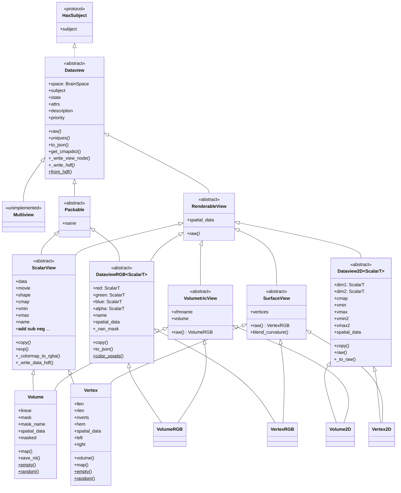
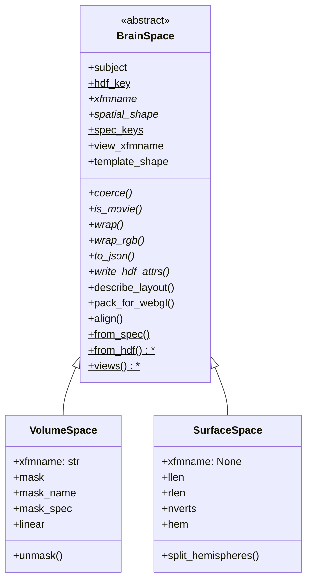

# `cortex.dataset` class hierarchy

Reference for the `Dataview` object graph. See
[TYPING_ALTERNATIVES.md](TYPING_ALTERNATIVES.md) for the restructuring options that
were considered and why this one was chosen.

## Two axes, two mechanisms

The six public classes are a 2x3 grid: two **spaces** crossed with three **channel
layouts**. The two axes are deliberately given different mechanisms.

|  | scalar (1 channel + 1D cmap) | 2D (2 channels + 2D cmap) | RGB (3 channels + alpha) |
| --- | --- | --- | --- |
| **volumetric** | `Volume` | `Volume2D` | `VolumeRGB` |
| **surface** | `Vertex` | `Vertex2D` | `VertexRGB` |
| *abstract base* | `ScalarView` | `Dataview2D` | `DataviewRGB` |

- **Channel layout is the inheritance axis.** All the shared logic -- colormapping,
  HDF, JSON, NaN handling, alpha -- lives in the three abstract bases.
- **Space is a component**, `view.space`, described by a `BrainSpace`. This is the
  open axis: adding a new kind of brain data means adding a space, not
  reimplementing the three bases.

Each concrete class has exactly two bases: its column, which carries all the state
and behaviour, and its spatial interface, which is stateless. That is not the
multiple inheritance this package was restructured to remove. `BrainData` and
`Dataview` used to be unrelated base classes joined only by MI in `Volume` and
`Vertex`, and that MI was load-bearing: `BrainData.to_json` and `VolumeData.copy`
called `super()` methods that existed nowhere in their own ancestry, resolving
only because `Volume`'s MRO threaded through `Dataview`. The spatial interfaces have no
`__init__`, no attributes and no cooperative `super()` chain, so nothing depends
on how they linearize. See [Narrowing the grid](#narrowing-the-grid).



Each concrete class reads down two edges: its column (left) and its spatial
interface (right).
`blend_curvature` is drawn on `SurfaceView` because that is the only place it is
defined; `Vertex` inherits it rather than declaring its own.

### `Packable`: the unit of transport

`Packable` sits between `Dataview` and the two columns that own an array, and it is
what `uniques()` yields. It answers a different question from the spatial axis:

| base | question | who has it |
| --- | --- | --- |
| `Packable` | "is this **one addressable array**?" | scalar and RGB columns |
| `RenderableView` | "can a renderer **sample** this?" | every spatial interface |

Neither implies the other, which is the point of keeping them separate. A 2D view
is renderable but **not** packable: it owns no array, only the two channels it
decomposes into, which is exactly why it has no `name`. Conversely a bare
`ScalarView` subclass is packable but has no spatial interface.

The one member is `name`, a content hash. That is what makes `Dataset.uniques()` a
`set` rather than a list -- two views over identical data collapse to one entry and
are stored and shipped once.

`uniques()` was annotated `Iterator[Dataview]`, which is wider than the truth and
lacks the one member every consumer reaches for first. `webgl.data.Package`
type-checked only because the list it built was `Any`; nothing warned that
`Dataview` has no `name`.

**Do not hoist `name` onto the spatial interface.** `VolumeRGB.name` and `VertexRGB.name` are both
exactly `_hash(self.spatial_data)`, which makes a single definition on
`RenderableView` look free. It is not: `ScalarView.name` hashes the *stored* array,
and for a masked `Volume` that is the flat masked array, not the unmasked 3-D
`spatial_data`. Unifying them silently renames every existing HDF node. Pinned by
`test_packable_name_is_not_hoisted_onto_the_spatial_interface`.

What *did* collapse is the two RGB definitions into one on `DataviewRGB`, since for
an RGB view the stored array *is* the sampled one, and its `name` is only ever a
browser key -- its channels are what become HDF nodes, each under its own name.
That needed `DataviewRGB` to see a spatial-interface member, which is why all three
column classes now list `RenderableView` among their bases: every concrete view is
renderable, so saying it on the column is what lets a helper that reads "the array"
live once there instead of twice in its volumetric and surface halves.

What `name` addresses is also asymmetric, which is why `Packable` promises only the
name and not what it hashes: for a scalar view it is both the HDF node name and the
browser key, whereas an RGB view writes its channels as four separate HDF nodes and
uses its own `name` only as the browser key.



Source locations:

| Class | Location |
| --- | --- |
| `Dataview`, `ScalarView`, `Volume`, `Vertex`, `Multiview`, `_masker` | `views.py` |
| `HasSubject`, `Packable`, `RenderableView`, `VolumetricView`, `SurfaceView` | `views.py` |
| `as_renderable`, `normalize`, `_detect_space`, `_from_hdf_data` | `views.py` |
| `Dataview2D`, `Volume2D`, `Vertex2D` | `view2D.py` |
| `DataviewRGB`, `VolumeRGB`, `VertexRGB`, `Colors` | `viewRGB.py` |
| `BrainSpace`, `VolumeSpace`, `SurfaceSpace`, the space registry | `_space.py` |
| `WebGLPayload`, `MosaicTexture`, `VertexAttributes`, `pack_png` | `_webgl.py` |
| `Dataset` | `dataset.py` |
| `_hash`, `_hdf_write`, `_find_mask` | `_hdf.py` |

Everything naming the grid lives in `views.py`, next to the classes it names:
there was a `_typing.py` holding the spatial ABCs' aliases and the boundary helper,
but once they became real classes it had nothing left to work around, and its last
occupant -- `as_renderable` -- belongs beside `RenderableView` anyway.
`cortex/dataset/__init__.py` must import `.views`
first — it resolves its circular dependency on `view2D`/`viewRGB` with deferred
imports at the bottom of its own module, so anything reaching those earlier sees a
partially initialised module. A test pins the import order.

`braindata.py` is a compatibility shim: `BrainData`, `VolumeData` and `VertexData`
are aliases for `ScalarView`, `Volume` and `Vertex`. The aliases preserve
`isinstance` exactly -- `isinstance(x, VolumeData)` was only ever true for
`Volume`, since `Volume2D` and `VolumeRGB` never inherited it.

Nothing inside the package reaches through `braindata` any more. `cortex/blender/`
used to (`isinstance(braindata, dataset.braindata.VertexData)`) and now tests
`dataset.Vertex` directly; what remains are `cortex/tests/test_braindata.py`, which
imports `_hash` from there, and `test_dataset.py`, which imports the three aliases
precisely to keep this shim honest. It is kept for code outside the repo. One
submodule path is still pinned internally and must keep resolving:
`cortex.dataset.views.Vertex`, imported by `cortex/database.py`.

## Generics: one covariant TypeVar

`Dataview2D` and `DataviewRGB` are generic in their channel type:

```python
ScalarT = TypeVar("ScalarT", bound=ScalarView, covariant=True)

class Volume2D(Dataview2D[Volume]): ...
class VolumeRGB(DataviewRGB[Volume]): ...
```

So `Volume2D.dim1` is a `Volume` and `VertexRGB.alpha` is a `Vertex` without either
class re-declaring anything. That last one is why the TypeVar earns its keep: **a
property's return type cannot be narrowed by re-annotation, only by re-implementing
the property.** `alpha` used to exist twice, ~25 near-identical lines in each RGB
class, purely because of that.

Covariance is sound here because the channels are read-only properties backed by
private fields, set once in `__init__`. It buys off the usual generics tax:
`Dataview2D[ScalarView]` accepts a `Volume2D`, which an invariant parameter would
reject.

Two limits worth knowing rather than discovering:

- mypy allows a covariant TypeVar in `__init__` parameters and in return position,
  but **not in ordinary method parameters**. The `alpha` setter therefore takes the
  base `ChannelLike`, not `ScalarT`.
- `isinstance(x, DataviewRGB[Volume])` is a runtime `TypeError`. Unsubscripted works
  and narrows to `DataviewRGB[Any]`, which is what the back-compat aliases rely on.

Narrowing a **bare annotation** in a subclass is accepted by mypy; narrowing an
**assigned** ClassVar is not. That asymmetry is why `space` is exposed as a
read-only property over a narrowed private `_space`, and it is exactly what made
the old `_cls` untypeable.

One thing the type system cannot express here: nothing stops
`DataviewRGB[Vertex]` from being declared with a `VolumeSpace`. Tying the space to
the channel would need higher-kinded types, so it stays a runtime constructor
check.

## Adding a new kind of brain data

Four declarations. The three bases supply everything else.

```python
@register_space
class MySpace(BrainSpace):
    hdf_key = "myspace"          # a label; nothing reads it -- see below
    @property
    def xfmname(self): ...                # the transform to sample through, or None
    def coerce(self, data): ...           # validate; record per-array geometry
    def is_movie(self, data): ...         # does it have a leading time axis
    @property
    def spatial_shape(self): ...
    def wrap(self, data, **kw): ...       # build a MyView over `data`
    def wrap_rgb(self, r, g, b, a, **kw): ...   # build a MyViewRGB
    def to_json(self): ...
    def write_hdf_attrs(self, h5, node): ...
    @classmethod
    def from_hdf(cls, attrs, *, subject, xfmname, mask): ...
    @classmethod
    def views(cls):
        return SpaceViews(scalar=MyView, twod=MyView2D, rgb=MyViewRGB)
        # `twod` and `rgb` are read when rebuilding a view from HDF; `scalar` is
        # not, since `wrap()` already builds one. Declared for completeness.

# written out in full below, under "The three view classes"
class MyView(ScalarView, MySpatial): ...     # + space-specific accessors
class MyView2D(Dataview2D[MyView], MySpatial): ...   # + a ctor naming its params
class MyViewRGB(DataviewRGB[MyView], MySpatial): ...
```

`spec_keys` is the one other declaration a space usually wants: the names of its
constructor arguments besides `subject`, `("xfmname",)` for `VolumeSpace` and empty
for `SurfaceSpace`. `BrainSpace.from_spec` reads it to require each of them before
constructing, which is how the composite views build a space when they are handed
raw arrays rather than channel objects. Each of the four used to be passed a
`lambda` naming the space class with `_require` applied to each of its arguments,
*and* a dict of those same keys to validate channel objects against -- so "a
volumetric space is subject plus xfmname, and both are mandatory" was written into
four view constructors instead of into `VolumeSpace`.

Five more members are deliberately *not* in the list above, because all five are
concrete on `BrainSpace` and most spaces should inherit them:

- `view_xfmname`, derived as `None if self.xfmname is None else [self.xfmname]`, so
  implementing `xfmname` gets slot 7 right for free. Override it only if a space
  needs a slot-7 value that is not just its transform name.
- `template_shape`, the shape a *fresh* array should have, which is what
  `ScalarView.empty` and `random` read. It defaults to `spatial_shape`, which is
  correct whenever the geometry is known as soon as the space is built. Override it
  only if it is not: `VolumeSpace` does, because `spatial_shape` reports the
  geometry of an array already bound by `coerce` and is `()` until then, so a fresh
  volume space has to look its shape up from the transform. Getting this wrong is
  quiet -- `empty` would build a zero-dimensional array rather than fail.
- `describe_layout(data)`, the keys telling the browser how to unpack the array it
  is sent, merged into `to_json(simple=True)`. Empty by default. `VolumeSpace`
  returns `shape` (the grid the mosaic tiles unpack into) and `SurfaceSpace`
  returns `split` (the hemisphere boundary) and `frames`. Distinct from `to_json`,
  which describes the *space* rather than a particular array bound to it -- which
  is why only this one takes the data. These keys are read by `dataset.js`, so
  they are a hard interface.
- `pack_for_webgl(data, raw=...)`, the array encoded for the browser. Defaults to
  raising, since only two encodings exist and a space with no browser
  representation is legitimate; a space wanting one returns `MosaicTexture` or
  `VertexAttributes`. See "What a new spatial kind must implement to be rendered"
  below.
- `align(first, second)`, two views' arrays in a layout where position *i* means
  the same place in both -- what a 2D view needs before it can colormap its two
  dimensions jointly. The stored arrays serve any space in which one array position
  is one location, which is why this is concrete. `VolumeSpace` overrides it
  because a flattened array's positions mean something only relative to its own
  mask: two arrays under the *same* mask already line up and are far smaller, while
  under different masks -- or with one flattened and one not -- only the unmasked
  volumes are comparable. A space that cannot align two views at all raises.

`hdf_key` is a label rather than a mechanism, despite the name. Detection on load
walks `registered_spaces()` in registration order and takes the first space whose
`from_hdf` returns non-`None`; nothing reads `hdf_key`, and neither built-in writes
a discriminator, because legacy files predate the idea and carry none. It is worth
setting anyway as the one place a space names itself — a space that *does* want a
key on disk has an obvious value to write in `write_hdf_attrs` and match in
`from_hdf`.

### What the space owns, and why

The rule is that anything depending on the *geometry* belongs to the space, so
that adding a space does not mean editing the columns. Seven things moved there,
each because it was the same question asked once per space:

| was | now | it was duplicated as |
| --- | --- | --- |
| `db.get_xfm(...).shape` vs `SurfaceSpace(...).nverts` | `template_shape` | 4 methods (`empty`/`random` x 2 classes) |
| `shape` vs `split`/`frames` in the simple JSON | `describe_layout` | 4 `to_json` overrides, now one each on `ScalarView` and `DataviewRGB` |
| slicing at `llen`, branching on movie-ness | `SurfaceSpace.split_hemispheres` | 4 properties (`left`/`right` on `Vertex` and `VertexRGB`) |
| whether two masked arrays can be compared elementwise | `align` | `Volume2D.raw` at 15 lines against `Vertex2D.raw` at 2 |
| "subject and xfmname are both mandatory" | `spec_keys` + `from_spec` | a lambda plus a dict in each of 4 constructors |
| the transform name a volumetric view reports | `xfmname`, now concrete on `VolumetricView` | 3 overrides, two of which reached through a channel |
| how an array reaches the browser | `pack_for_webgl` | 3 `isinstance(brain, SurfaceView)` forks in `webgl/data.py`, plus a guard for "neither" |

`split_hemispheres` also removed the one place a view reached *through a channel*
for geometry: `VertexRGB.left` read `self.red.llen` because `DataviewRGB.space` is
typed `BrainSpace`. `VertexRGB` now narrows `space` to `SurfaceSpace` the way
`Vertex` does -- sound because `DataviewRGB[Vertex]` fixes the channel type, which
the generic base cannot state.

What deliberately did **not** move:

- `Volume.map`, `Vertex.map`, `Vertex.volume` -- these transform *between* spaces
  via `cortex.utils.get_mapper`, so they are a property of a space *pair*, and
  putting them on `BrainSpace` would drag the mapper into `_space.py`.
- `Volume.save_nii` -- the affine it needs is a space fact, but writing a file is
  not; only the lookup is a candidate, and it is one line.
- `__repr__` -- the mask description is space knowledge, but the payoff is
  cosmetic.

`MySpatial` is the spatial interface — `VolumetricView` if the data samples through a
transform, `SurfaceView` if it is per-vertex, or a new subclass of
`RenderableView` supplying `spatial_data` if it is sampled some other way. A view
that inherits neither is still a perfectly good `Dataview`; it just cannot be
passed to the flatmap renderers, and `as_renderable` will say so.

`register_space` puts it in the registry that `_from_hdf_data`, `_from_hdf_view`
and `normalize` dispatch through, so HDF round-tripping needs no edits. Order
matters: the registry is consulted in order and the first space whose `from_hdf`
returns non-`None` wins.

Order is by **`fallback`**, not by arrival. A fallback space claims any node no
other space wanted, and exists only because legacy files carry no space
discriminator: `SurfaceSpace` sets it, and accepts anything without a transform,
which is how a pre-registry file is recognised. `register_space` inserts a
non-fallback space ahead of every fallback one, so the catch-alls stay last
however many spaces are added. Leave `fallback` alone; test in `from_hdf` for
something you write yourself in `write_hdf_attrs`, and you will be consulted
ahead of the built-in catch-all.

That last part is recent. `register_space` used to append, which meant a space
registered by a third party -- necessarily after `cortex.dataset` has registered
its own two -- landed *behind* `SurfaceSpace` and was never reached:
`SurfaceSpace` claimed the node, `wrap` built a `Vertex`, `coerce` raised on the
vertex count, and `cortex.load` swallowed that per view and returned an **empty**
Dataset, so the data was silently gone. Writing was unaffected throughout. Nobody
noticed because both built-in spaces are registered inside `_space.py`, in an
order chosen by hand, so the append semantics were never exercised by a third
registration. Pinned by `test_a_third_space_registers_ahead_of_the_catch_all`,
which also checks that a *second* fallback still sorts behind every real space.

### The three view classes, written out

`MySpace` is where the thought goes. The three view classes are mostly signature:
across the six built-in views they are **141 lines of signature, 383 of docstring
and 228 of body**, and a single constructor is routinely thirty-five lines for two
statements. Copy the three skeletons below and fill them in.

Each member is marked **required** (the bases will not let you instantiate without
it), **narrowing** (the implementation is inherited; you are only restating the
concrete type so callers do not need a cast), or **optional**.

#### The scalar view

```python
class MyView(ScalarView, MySpatial):
    """One-line summary, then a numpydoc ``Parameters`` block.

    Not optional. `docs/api_reference_flat.rst` autosummaries this class through
    `_templates/class.rst`, which renders the class docstring verbatim -- so this
    is where users read what the constructor takes. Budget 25-35 lines.
    """

    def __init__(
        self,
        data: Union[npt.NDArray, str, None],
        subject: Union[str, bytes],
        myarg: str,                      # one per name in MySpace.spec_keys,
                                         # positional: `Volume(arr, "S1", "fullhead")`
                                         # is the spelling every doc and test uses
        cmap: Optional[str] = None,
        vmin: Optional[float] = None,
        vmax: Optional[float] = None,
        description: str = "",
        state: Any = None,
        priority: int = 1,
        attrs: Optional[Mapping[str, Any]] = None,   # metadata; the only route
                                         # for a key that is not a parameter.
                                         # Do NOT add **kwargs -- see
                                         # "Unknown keywords" below
    ) -> None:
        # The whole job: build the space, hand it up. ScalarView.__init__ calls
        # space.coerce(data), which is where per-array geometry gets recorded.
        super().__init__(
            data,
            MySpace(subject, myarg),
            cmap=cmap, vmin=vmin, vmax=vmax,
            description=description, state=state,
            priority=priority, attrs=attrs,
        )
        # Nothing else. `ScalarView.__init__` defaults vmin/vmax to the 1st/99th
        # data percentiles, so this view leaves construction with numeric bounds
        # like every other -- see "One rule for vmin/vmax" below.

    _space: MySpace                      # a *bare* annotation, which narrows the
                                         # attribute without shadowing the property

    @property                            # narrowing -- but load-bearing, since
    def space(self) -> MySpace:          # everything below reads space-specific
        return self._space               # members off it

    @property                            # REQUIRED
    def spatial_data(self) -> npt.NDArray:
        """The array a renderer samples, with a leading frame axis.

        Published as `volume` or `vertices` too, if MySpatial is one of the two
        built-in spatial interfaces. Do *not* also implement those.
        """

    @property                            # narrowing; ScalarView._build_raw does it
    def raw(self) -> MyViewRGB:
        return cast(MyViewRGB, self._build_raw())

    # `empty`/`random` are the one place `**kwargs` remains, forwarding to the
    # constructor above -- so a bad keyword here is caught on the call rather than
    # by mypy. See "Unknown keywords" below.
    @classmethod                         # optional, but two lines each
    def empty(cls, subject: str, myarg: str, value: float = 0, **kwargs: Any) -> Self:
        shape = MySpace(subject, myarg).template_shape
        return cls(cls._sample(shape, value), subject, myarg, **kwargs)

    @classmethod
    def random(cls, subject: str, myarg: str, **kwargs: Any) -> Self:
        shape = MySpace(subject, myarg).template_shape
        return cls(cls._sample(shape, None), subject, myarg, **kwargs)

    def __repr__(self) -> str:           # optional
        return "<my data for (%s)>" % self.subject

    # Then whatever vocabulary the space exposes, one line each. These are what
    # `Vertex.llen`/`rlen`/`nverts`/`hem` and `Volume.linear`/`mask`/`mask_name`
    # are, and they are the reason `space` is narrowed above:
    #
    #     @property
    #     def nthings(self) -> int:
    #         return self.space.nthings
```

Filled in against a synthetic 10-element space, all three of these work: scalar
construction from an array and from a movie, `spatial_data`, the arithmetic
operators, `empty`/`random`, `raw` (which round-trips through `space.wrap_rgb`),
2D construction from both arrays and views, RGB construction including a movie,
`to_json` in both modes, `uniques()` collapsed and expanded, `name`,
`as_renderable`, and a full HDF round trip -- all three columns save and reload as
their own classes, with the space rebuilt from the discriminator its
`write_hdf_attrs` wrote. Pinned by
`test_the_documented_skeleton_for_a_new_space_actually_works`, which is this
skeleton filled in and exercised, so the doc cannot rot into describing an
extension point that no longer exists. It lives in `cortex/tests/test_new_space.py`
along with every other test that defines a space or a view this package does not
ship -- the ones cited by name elsewhere in this document included.

Everything else on the scalar column is inherited and should not be reimplemented:
`data`, `movie`, `shape`, `name`, `copy`, `to_json`, `uniques`, `save`, the eight
arithmetic operators, `_write_data_hdf` and `_write_hdf` -- 29 members, 86
statements.

#### The 2D view

```python
class MyView2D(Dataview2D[MyView], MySpatial):
    """Summary plus a numpydoc ``Parameters`` block, as above. Budget 30-40 lines."""

    def __init__(
        self,
        dim1: Union[npt.NDArray, MyView],
        dim2: Union[npt.NDArray, MyView],
        subject: Optional[str] = None,   # optional, because it can come from dim1
        myarg: Optional[str] = None,     # likewise
        description: str = "",
        cmap: Optional[str] = None,
        vmin: Optional[float] = None,
        vmax: Optional[float] = None,
        vmin2: Optional[float] = None,
        vmax2: Optional[float] = None,
        alpha: Optional[npt.NDArray] = None,   # overrides the colormap's alpha
        state: Any = None,
        priority: int = 1,
        attrs: Optional[Mapping[str, Any]] = None,
    ) -> None:
        chan1, chan2 = _resolve_2d_channels(
            dim1,
            dim2,
            channel_cls=MyView,
            space_cls=MySpace,
            subject=subject,
            spec={"myarg": myarg},       # the same keys as MySpace.spec_keys;
                                         # _resolve_channels uses them both to
                                         # validate channel objects and to build
                                         # the space when handed raw arrays
            ranges=((vmin, vmax), (vmin2, vmax2)),
        )
        super().__init__(
            chan1, chan2,
            description=description,
            cmap=cmap, vmin=vmin, vmax=vmax, vmin2=vmin2, vmax2=vmax2,
            alpha=alpha, state=state, priority=priority, attrs=attrs,
        )

    @property                            # narrowing; Dataview2D.raw does it, via
    def raw(self) -> MyViewRGB:          # space.align + space.wrap_rgb
        return cast(MyViewRGB, super().raw)

    def __repr__(self) -> str:           # optional
        return "<2D my data for (%s)>" % self.dim1.subject
```

That is the whole class. No `spatial_data`, no `volume`/`vertices`, no `to_json`,
no `_write_hdf` -- a 2D view owns no array of its own, so all of that is on
`Dataview2D`. Override `_write_hdf` only if slot 7 needs something other than
`space.view_xfmname`, as `Volume2D` does to record a transform name per dimension.

#### The RGB view

```python
class MyViewRGB(DataviewRGB[MyView], MySpatial):
    """Summary plus a numpydoc ``Parameters`` block. Budget 60-70 lines -- the
    three channel colours, the HSV caps and the per-channel bounds all need
    documenting."""

    def __init__(
        self,
        channel1: Union[npt.NDArray, MyView],
        channel2: Union[npt.NDArray, MyView],
        channel3: Union[npt.NDArray, MyView],
        subject: Optional[str] = None,
        myarg: Optional[str] = None,
        alpha: Optional[Union[npt.NDArray, MyView]] = None,
        description: str = "",
        state: Any = None,
        channel1color: Color[int] = Colors.Red,
        channel2color: Color[int] = Colors.Green,
        channel3color: Color[int] = Colors.Blue,
        max_color_value: Optional[float] = None,
        max_color_saturation: float = 1.0,
        vmin: Optional[Union[float, tuple[float, float, float]]] = None,
        vmax: Optional[Union[float, tuple[float, float, float]]] = None,
        autorange: Literal["shared", "individual"] = "individual",
        priority: int = 1,
        attrs: Optional[Mapping[str, Any]] = None,   # forward it, or a reloaded
                                                     # view loses its metadata
    ) -> None:
        red, green, blue, resolved_alpha = _resolve_rgb_channels(
            (channel1, channel2, channel3),
            channel_cls=MyView,
            space_cls=MySpace,
            subject=subject,
            spec={"myarg": myarg},
            colors=(channel1color, channel2color, channel3color),
            max_color_value=max_color_value,
            max_color_saturation=max_color_saturation,
            vmin=vmin, vmax=vmax, autorange=autorange,
            alpha=alpha,
        )
        super().__init__(
            red, green, blue,
            alpha=resolved_alpha,
            subject=subject,
            description=description, state=state, priority=priority,
            attrs=attrs,
        )

    @property                            # narrowing, if any space-specific member
    def space(self) -> MySpace:          # is read below. Sound because
        return self.red.space            # DataviewRGB[MyView] fixes the channel
                                         # type; the generic base cannot say so

    def __repr__(self) -> str:           # optional
        return "<RGB my data for (%s)>" % self.subject
```

All three columns take `attrs` as a named parameter and none ends in `**kwargs`,
so an unknown keyword to any of them is a plain `TypeError` from Python -- which is
also what lets mypy flag it. A space's three view classes each have to declare and
forward `attrs`, or metadata is dropped when the view is rebuilt from HDF; the
skeleton test catches that omission.

Also the whole class. `name`, `__hash__`, `spatial_data`, `to_json`, `_write_hdf`,
`alpha` and its NaN masking, `_default_alpha`, `_channel_stack`, `_rgba_stack`,
`uniques`, `copy` and `color_voxels` are all on `DataviewRGB` -- 23 members, 155
statements, and eleven of those members were per-subclass until recently.

#### Why none of this is generated

The obvious next step is to generate the three classes from the space and let a new
one subclass only for extras. It was costed and rejected; the numbers are why.

Taking the surface family as one space's cost, of roughly 380 mechanical lines:

| | lines | generatable? |
| --- | --- | --- |
| the three `__init__` signatures | 90 | **no** |
| the three class docstrings | 123 | **no** |
| the space's own vocabulary accessors | 17 | no -- it is new by definition |
| genuinely new logic (`spatial_data`, cross-space maps, `__getitem__`) | 101 | no |
| narrowing properties (`space`, `raw` x 3) | 20 | **no** |
| `empty`/`random` and three `__repr__`s | 24 | yes |

- **`__init__`** cannot be generated because the space-identifying argument is
  passed *positionally* -- `cortex.Volume(arr, "S1", "fullhead")` -- so a generic
  `__init__(self, data, subject, **spec)` cannot put `myarg` in position 3. That is
  an API break, not a refactor. A `**kwargs` constructor also gives up parameter
  types and positional arity: mypy rejects `Vertex2D(a, a, vmin="lo")`,
  `VertexRGB(a, a, a, 3)`, a fourth positional to `Vertex`, and -- since no
  constructor ends in `**kwargs: Any` any more -- every misspelled keyword. A
  `**kwargs` constructor would give all of that back up, which is now the strongest
  argument against generating these. See "Unknown keywords" below.
- **Class docstrings** are rendered verbatim by `autoclass`, and they *are* the
  parameter documentation. Generating them means templating numpydoc, which is
  worse than writing it.
- **Narrowing properties** exist precisely to state a static type. A generated
  property has no narrowed type, so nothing is saved.
- **`empty`/`random`** genuinely could be `def random(cls, *args, **kwargs)`
  forwarding to `cls._space_cls(*args)`. But `Volume.empty("S1", "fullhead", 5)`
  passes `value` positionally today, and `*args` would swallow the `5` into the
  space constructor as `mask=5` -- silent breakage. Making `value` keyword-only
  fixes it and is an API change; and `*args: Any` means `Volume.empty("S1")`
  type-checks and fails at runtime.

So the ceiling is about 6% of the mechanical lines, half of it behind an API
change, in exchange for an `__init_subclass__` mechanism. If the per-space cost is
still the problem, the lever is the ~101 lines of genuinely new logic, and the only
help available there is this document.

### One channel resolver for both composite columns

`Dataview2D` and `DataviewRGB` both accept either already-built channel views or raw
arrays, and both have to reject the mixture. That validation -- is the first
argument a channel object; are the rest; do they agree on subject; do they agree on
the space's `spec_keys` -- was written out twice, in the same order, with different
wording. It is now `views._resolve_channels`, which returns the space plus the
channels if they arrived as views:

```python
space, views = _resolve_channels(
    [dim1, dim2], channel_cls=Volume, space_cls=VolumeSpace,
    subject=subject, spec={"xfmname": xfmname}, argnames=("dim1", "dim2"),
)
```

What is left in each column is only what genuinely differs: per-dimension
`vmin`/`vmax` for 2D, the colour basis and `color_voxels` for RGB. `argnames` exists
solely so the messages can name the offending argument, since one column calls them
`dim1`/`dim2` and the other `channel1`..`channel3`.

One quirk is preserved rather than unified: the RGB column requires `ndarray`
channels while the 2D column `np.asarray`'s whatever it is given. Loosening RGB
would start accepting lists there while `Volume(list, ...)` still fails with an
`AttributeError` from `coerce`, so the inconsistency is left where it is visible.

`space.wrap()` is the abstraction that keeps the rest space-agnostic: the channel
resolvers in `view2D.py` and `viewRGB.py`, and all three HDF factories, build views
through it and never name `Volume` or `Vertex`. A space is per-view, not shared:
`coerce()` records facts that depend on the particular array bound to it (which
mask a flattened array matches, which hemisphere a half-length array covered), so
`wrap()` uses `self` only as a template of parameters.

### Unknown keywords: no constructor has a `**kwargs` sink

Whatever reached `**kwargs: Any` became `Dataview.attrs`, written to HDF slot 6
and shipped in the browser payload. That made metadata convenient -- `stim` is
read by `webgl/view.py` -- and it also swallowed every misspelling of a real
parameter. `Volume(data, subj, xfm, cmpa="hot")` built a view with the **default**
colormap plus an attribute nothing would ever read, and reported nothing.

None of the six constructors ends in `**kwargs` now. An unrecognized keyword is a
`TypeError` from Python itself:

```python
cortex.Volume(data, "S1", "fullhead", cmpa="hot")   # TypeError: unexpected keyword 'cmpa'
cortex.Volume(data, "S1", "fullhead", stim="a.mp4") # TypeError: likewise
cortex.Volume(data, "S1", "fullhead", attrs={"stim": "a.mp4"})   # this is the way in
```

Metadata has not gone away; it has one route instead of two. `attrs=` is an
explicit parameter on all six, and the keys still reach slot 6 and the payload.
Pinned by `test_an_unrecognized_constructor_keyword_is_rejected` and
`test_attrs_is_the_route_for_metadata_that_is_not_a_parameter`.

**Removing the sink is what buys the static check.** mypy could never flag a
misspelling while a constructor ended in `**kwargs: Any`; it now flags all six,
and reports a better suggestion than any string-similarity heuristic could,
because it knows the real parameter list:

```
error: Unexpected keyword argument "cmpa" for "Volume"
error: Unexpected keyword argument "vmax2" for "Volume"; did you mean "vmax"?
```

The inheritance structure does not get in the way of that, which is worth stating
because it looks like it should: mypy checks a call against the *concrete* class's
`__init__`, and `__init__` is exempt from Liskov override checking, so
`Volume.__init__` differing from `ScalarView.__init__` is fine. The abstract
columns are checked too -- instantiating `ScalarView` directly with a bad keyword
reports both the keyword and the abstract-class error.

Two forwarding paths keep `**kwargs: Any`, so a bad keyword there is caught at
runtime rather than by mypy. Both are internal, not places a caller types a
keyword:

- `empty`/`random`, which forward to the constructor. Closing this needs `value`
  to become keyword-only, which is an API change -- see [Why none of this is
  generated](#why-none-of-this-is-generated) for the same argument in the other
  direction.
- `BrainSpace.wrap`/`wrap_rgb`, the indirection that lets `.raw` and the HDF
  factories avoid naming a concrete class. Typing it precisely would need a
  signature per space, which is the thing it exists to avoid.

Two consequences of the strict rule worth knowing rather than discovering:

- **`alpha` on a 2D view is now a real parameter.** It overrides the alpha channel
  the 2D colormap produces, and it used to be read back out of `attrs` under that
  key -- which only worked because the sink put it there. It is declared on
  `Dataview2D`, `Volume2D` and `Vertex2D`, stored as `_alpha`, and carried by
  `copy()`. Pinned by `test_the_2d_alpha_override_is_a_parameter`.
- **`priority` is a real parameter on all six**, not just the RGB column. It was
  reaching `attrs` through the sink everywhere else. Carried metadata still wins
  over it, via `setdefault`: the parameter's default is indistinguishable from an
  explicit value, so ordering it the other way meant `copy()` and an HDF reload
  both reset a priority of 3 back to 1, since neither passes the parameter.
  Pinned by `test_priority_survives_copy_and_reload_for_every_view`.

`attrs=` is deliberately **not** validated, which is also why it is the route
`copy()` and the three HDF factories use. Metadata on an existing view is data by
then, and a file written by an older pycortex may hold a key no current parameter
matches; `Dataset.from_file` swallows per-view exceptions, so rejecting it would
make the view vanish rather than fail loudly. Pinned by
`test_carried_attrs_are_not_revalidated`.

Dropping the sink is also what let the HDF factories stop hand-filtering their
kwargs. `_from_hdf_view` had a `_RGB_KWARGS = ("description", "state", "priority")`
whitelist whose real job was to discard a `cmap=None` that `from_hdf` had
synthesised from the JSON `null` in slot 2 -- the slot an RGB view writes *because
it has no colormap*. `from_hdf` no longer invents the argument, so the RGB branch
forwards what it was given. One filter survives, in `_from_hdf_data`, and it is not
a workaround for the construction path: there the *view* record said "scalar", so
it carried a colormap and bounds, and only opening the data node revealed legacy
packed RGB. Those three arguments describe a colormap the view does not have, so
they are meaningless rather than merely unaccepted.

## Narrowing the grid

Both axes are real classes, so every narrowing test is a nominal `isinstance`.

|  | volumetric | surface |
| --- | --- | --- |
| **spatial** | `VolumetricView` | `SurfaceView` |
| either spatial kind | `RenderableView` | |
| **column** (channels) | `ScalarView` / `Dataview2D` / `DataviewRGB` | same |

The columns were always classes; only the spatial axis lacked a type, which is why
consumers duck-typed `hasattr(braindata, "xfmname")`.

### Nothing branches on the spatial kind

An `if volumetric / else surface` fork silently encodes "there are exactly two
spatial kinds": a third would take the `else` and then fail, or draw the wrong
thing. So the
renderer asks for the two facts it needs instead of asking what it is holding:

- `view.space.xfmname` — the transform to sample *through*, or `None`. Owned by the
  space, and HDF slot 7 derives from the same value.
- `view.spatial_data` — the array to sample. Owned by the *view*, and the one
  member a spatial kind implements. The spatial interfaces then publish it under
  the name their space has always used, `VolumetricView.volume` and
  `SurfaceView.vertices`, both concrete.

  This started out the other way round -- `volume`/`vertices` abstract and
  `spatial_data` derived from whichever one the subclass inherited -- which cost a
  property per space per column, since a column holds one array and had to publish
  it under the name of each space it serves. Pinned by
  `test_the_spatial_array_is_implemented_once_per_view`, because re-abstracting
  `volume`/`vertices` would quietly bring all four of those properties back.

```python
def make_flatmap_image(braindata: RenderableView, ...):
    mask, extents = get_flatmask(braindata.subject, ...)
    pixmap = get_flatcache(braindata.subject, braindata.space.xfmname, ...)
    data = braindata.spatial_data
```

`as_renderable` is likewise one `isinstance(view, RenderableView)` rather than a
tuple of known kinds. Adding one therefore touches neither. Pinned by
`test_a_third_spatial_kind_needs_no_change_to_the_renderer`, which renders through a kind
this package has never seen.

Tests *for* a specific capability stay as positive `isinstance` checks and are
still correct — `with_dropout` needs a transform, so
`isinstance(dataview, VolumetricView)` is exactly the right question, and it
correctly rejects a third spatial kind that has none.

**Which mechanism for which question.** Protocols and ABCs are both used here, for
different questions, and the split is deliberate:

| question | mechanism | why |
| --- | --- | --- |
| "what kind of view is this?" | ABC — `VolumetricView`, `SurfaceView` | asked at *runtime*, so the check must be sound; only a nominal base gives that |
| "what does this function need?" | Protocol — `HasSubject` | a *static* contract on a parameter; never `isinstance`d |

`HasSubject` is the only Protocol left. There was a second, `SupportsCurvatureBlend`,
which vanished when `blend_curvature` moved onto `SurfaceView`: once the method had
one home, nothing needed a structural name for "things it can be called on".

`HasSubject` is deliberately **not** `runtime_checkable`, so `isinstance` against
it raises `TypeError` — which mechanically prevents the presence-only check from
creeping back in. A test pins that.

It is also declared exactly once, in `views.py`.
That matters more than it looks: two structurally identical Protocols type-check
interchangeably, so a duplicate declaration is invisible to mypy *and* to the test
asserting `Dataview` claims it, and the two copies then drift apart silently.

The payoff for the Protocol half is that a function can claim exactly what it
touches. Every one of `add_curvature`, `add_rois`, `add_sulci`, `add_custom` and
`add_cutout` reads nothing but `dataview.subject`, yet they were annotated
`Dataview` (or a `Union[Vertex, Volume, Dataview]` that collapses to it). They now
take `HasSubject`.

### Which class implements what

Every claim below is declared in the class's bases, not left to be rediscovered
structurally, so mypy checks it and a missing member makes the class abstract.
Pinned by `test_protocol_implementations_are_declared_not_merely_structural`.

| class | spatial (ABC) | column (ABC) | `HasSubject` | `blend_curvature` |
| --- | --- | --- | :-: | :-: |
| `Volume` | `VolumetricView` | `ScalarView` | ✓ | |
| `Volume2D` | `VolumetricView` | `Dataview2D[Volume]` | ✓ | |
| `VolumeRGB` | `VolumetricView` | `DataviewRGB[Volume]` | ✓ | |
| `Vertex` | `SurfaceView` | `ScalarView` | ✓ | ✓ |
| `Vertex2D` | `SurfaceView` | `Dataview2D[Vertex]` | ✓ | ✓ |
| `VertexRGB` | `SurfaceView` | `DataviewRGB[Vertex]` | ✓ | ✓ |

`HasSubject` is claimed once, by `Dataview`, so it covers every view including any
added later. `blend_curvature` is defined once, as a concrete method on
`SurfaceView` — curvature blending is a surface-only contract, so all three surface
views inherit one implementation. It used to be three identical forwarding methods
delegating to a module-level function typed against a `SupportsCurvatureBlend`
protocol; hoisting it removed the three copies, the function and the protocol.

The spatial interfaces also narrow `raw`: `VolumetricView.raw` returns `VolumeRGB` and
`SurfaceView.raw` returns `VertexRGB`, rather than the base's `DataviewRGB`. So
`view.raw.volume` and `view.raw.left` resolve without a further cast.

That narrowing is the one thing `Volume2D` and `Vertex2D` still say about `raw`.
The implementation is one method on `Dataview2D`, which asks
`space.align(dim1, dim2)` for the pair of arrays to colormap and hands them to
`_to_raw`; each subclass keeps a three-line override that only restates the
concrete return type, which the shared one cannot name because it does not know
the space.

Note that inheriting a Protocol explicitly does **not** re-enable `isinstance`
against it — that still requires `@runtime_checkable`, which these deliberately
lack. The claim is checked statically; the runtime guard stays shut.

**Why abstract bases rather than `Protocol` for the spatial axis.** A `runtime_checkable`
protocol's
`isinstance` tests only for the *presence* of the member names — it cannot tell a
property from a method or check any types — so an object carrying an unrelated
`subject`/`xfmname`/`volume` satisfies it. Composing several protocols does not
help; the check is still per-name `hasattr`. Nominal bases give a real class
check, and because their members are abstract, a view that forgets one cannot be
instantiated. The trade is that conformance is explicit opt-in: a third-party view
must inherit one of them rather than merely happening to have the attributes.
Both properties are pinned by tests.

They subclass `Dataview`, so narrowing to one keeps every `Dataview` member
available. Do *not* convert a `Dataview` into some separate renderable type and
carry it around — an intermediate design did that with protocols and broke
`get_cmapdict`, `add_curvature`, `add_rois`, `add_sulci` and `add_custom`, because
protocols are structural where `Dataview` is nominal.

**`isinstance` tuples must be inline literals.** `isinstance(v, (ScalarView,
Dataview2D))` narrows; hoisting that tuple into a module constant annotated
`tuple[type, ...]` does not, because the annotation loses the members. The same
trap applies to any such constant.

This is not a return to the multiple inheritance the package was restructured to
remove. The spatial interfaces are stateless: no `__init__`, no attributes, no
cooperative `super()` chain. `BrainData`/`Dataview` were pathological because each
carried state and called `super()` methods that resolved only through a subclass's
MRO. The MROs here linearize cleanly:

```
Volume    -> ScalarView  -> Packable    -> VolumetricView -> RenderableView
          -> Dataview -> HasSubject -> Protocol -> Generic -> ABC -> object
VertexRGB -> DataviewRGB -> Packable    -> SurfaceView    -> RenderableView
          -> Dataview -> HasSubject -> Protocol -> Generic -> ABC -> object
Volume2D  -> Dataview2D  -> VolumetricView -> RenderableView -> Dataview
          -> HasSubject  -> Protocol -> Generic -> ABC -> object
```

Column before spatial in all three, because the column is listed first in the bases
and carries the implementations; the spatial interface contributes only concrete
names for what the column already holds (`volume`, `vertices`, `xfmname`) plus
`blend_curvature`, none of which anything overrides.

That order is load-bearing, and it is why `spatial_data` has to be implemented on
the *column* rather than on the interface. `DataviewRGB` precedes `SurfaceView` in
`VertexRGB`'s MRO, so an implementation on the column wins over anything the
interface offers -- which is exactly what is wanted here, and exactly what would
break if the interface tried to own the array again.

The same rule constrains `Packable`. It declares `name` abstract and precedes the
spatial interface, so anything a spatial interface implements must stay off
`Packable`, or the abstract stub would shadow a working implementation. `name` is
safe because both columns define it ahead of `Packable`.

A synthesised alpha must carry the same frame axis as the channels it accompanies,
or `_rgba_stack` cannot stack the four into one array. `VertexRGB` used to size it
from `vertices.shape[1]`, the vertex count alone, so surface RGB *movies* were
unconstructible; both columns now size from the channel's stored `data`, which
carries the frame axis exactly when the channels do. Pinned by
`test_rgb_default_alpha_tracks_the_channels_frame_count`, which also pins that a
one-frame view keeps the shape it always had -- that shape feeds the content hash
used as the HDF node name. (`VolumeRGB` previously sized from `volume`, the same
values with the frame axis already prepended, so its auto-alpha was wrapped as a
one-frame movie. That unmasks back to an identical array, and an auto-generated
alpha is never written to HDF nor shipped on its own, so nothing outside the class
could observe the difference.)

Note that `volume` and `vertices` mean different things down the scalar column
than down the other two: `Volume.volume` is the scalar array, while
`Volume2D.volume` and `VolumeRGB.volume` are uint8 RGBA, their data having already
been colormapped. That split has always been there across `Vertex` and `Vertex2D`;
it is a property of the column, not of the space.

## What a new spatial kind must implement to be rendered

The two renderers ask for different amounts, and the difference is not a matter of
tidiness: `spatial_data` is enough to *draw a flatmap*, but not enough to *ship
data to a browser*, because the browser needs to know how the bytes are laid out.
Both are now open to a new spatial kind, but the webgl one is open only to the
extent of picking between the two layouts `dataset.js` understands.

### `quickflat` — nothing beyond the spatial ABC

Implement `spatial_data` and give the space an `xfmname` (`None` if the data is
not sampled through a transform) and `quickshow`/`make_flatmap_image` work. The
renderer never asks what it is holding. Pinned by
`test_a_third_spatial_kind_needs_no_change_to_the_renderer`.

Three flatmap *decorations* legitimately require a transform and will reject a kind
that has none, with a `TypeError` naming the class: `with_dropout`,
`with_connected_vertices`, and `add_connected_vertices`. That is a capability
requirement, not a closed-world assumption — there is nothing a transformless kind
could do with them.

### `webgl` / `webshow` — `space.pack_for_webgl`, returning one of two encodings

`webgl/data.py`'s `Package` reads `spatial_data` like everything else, and then asks
the space to encode it: `space.pack_for_webgl(spatial_data, raw=...)` returns a
`WebGLPayload`, of which exactly two exist because `dataset.js` can read exactly
two. `raw` says the array is 4-channel uint8 from an RGB view rather than scalar
floats.

| | `MosaicTexture` | `VertexAttributes` |
| --- | --- | --- |
| returned by | `VolumeSpace` | `SurfaceSpace` |
| array shape | `(frames, z, y, x[, 4])` | `(frames, nverts[, 4])` |
| packing | `volume.mosaic()` per frame → PNG | raw `.npy` bytes |
| JSON (`describe()`) | `raw`, and `mosaic` set to the tile shape | `raw` only, no `mosaic` key |
| slot 7 | `[xfmname]` | `null` |
| vertex order | `reorder` is a no-op | **must** be permuted by `Package.reorder` into the CTM's order |
| JS path | texture, sampled through the transform | per-vertex attribute |
| premultiplied alpha | no — Three.js premultiplies on texture upload | **yes**, done in Python |

Both live in `_webgl.py`, next to each other, because the packing, the `mosaic`
key, the reordering and the premultiply are one decision. `Package` used to make it
three times over —
`isinstance(brain, SurfaceView)` for the premultiply, again for the packing, again
in `reorder` — plus a fourth `not isinstance(brain, VolumetricView)` guard for
"neither". So a new spatial kind had to inherit `VolumetricView` or `SurfaceView`
*for the webgl path to work*, even though `quickflat` accepts a bare
`RenderableView`, and that was the one place the spatial axis was genuinely not
open.

It is open now, in the sense that matters here: a space picks an encoding, so it
reaches the browser without any edit to `webgl/data.py`. Pinned by
`test_a_third_space_packs_its_own_webgl_encoding`. What is *not* open is the set of
encodings — that is a constraint of the browser code, not of this package.
`dataset.js` selects the path by testing `mosaic === undefined`, so a kind wanting a
third layout still has to add a matching branch there (and to `shaderlib.js`, if it
samples differently).

`BrainSpace.pack_for_webgl` is concrete rather than abstract, and its default
raises a `TypeError` naming the space, both encodings and the JS file. A space with
no browser representation is a legitimate thing to have — `quickflat` needs only
`spatial_data` — so this is a capability the space declines rather than one it
forgets. Pinned by `test_a_space_with_no_webgl_encoding_says_so_once`, which also
records what the old shape cost: a third kind fell through to `volume.mosaic` and
died on "Invalid data shape", several frames deep, naming neither the view nor the
real problem.

Between `pack_for_webgl` and `describe_layout` the whole wire contract is now
stated by the space. `mosaic` used to be the exception — assembled by the consumer
while its sibling keys `shape`, `split` and `frames` came from the space — and it
is `MosaicTexture.describe()` that closed that gap. Keys must be *absent* rather
than null when they do not apply, since the JS tests `mosaic === undefined`.

Treat `_webgl.py` as a compatibility surface with its own tests, not as a place to
tidy up: the premultiplied-alpha asymmetry above is a fact about Three.js
(`tex.premultiplyAlpha` on upload for the texture path, nothing at all for vertex
attributes), and it is pinned in both directions by
`test_vertexrgb_alpha_is_premultiplied_in_package` and
`test_volumergb_alpha_is_NOT_premultiplied_in_package`.

The geometry is always a surface mesh, whatever the spatial kind: `brainctm.py`
builds it from `db.get_surf`, so volumetric data is rendered by sampling its texture
at each vertex's coordinates. A kind whose data cannot be evaluated per-vertex has no webgl
representation at all.

`Package` iterates `uniques(collapse=True)`, which decomposes 2D views into their
scalar channels, so only the scalar and RGB columns ever reach it. That is why
nothing there mentions `Dataview2D`.

### Consumers that are deliberately narrower

These name a concrete class because they need a specific capability, and a new kind
will be rejected rather than mis-drawn:

| consumer | requires | why |
| --- | --- | --- |
| `volume.show_slice` | `Volume` | slices the 3D array against an anatomical reference |
| `blender.add_cutdata` | `Volume` or `Vertex` | samples one colormapped value per vertex, so needs a single `cmap` |
| `Mapper.__call__` | `Vertex` | splits per-hemisphere by vertex count |

## The wire format is a hard interface

`webgl/resources/js/dataset.js` dispatches **structurally**; no Python class name
reaches the browser.

| JS test | Meaning |
| --- | --- |
| `mosaic === undefined` | surface data |
| `json.data[i] instanceof Array` | 2D view |
| `json.raw` | RGB, 4-channel uint8 texture path |
| `json.vmin[0] instanceof Array` | 2D ranges |

`module.makeFrom(dvx, dvy)` also synthesizes a 2D view client-side. The eight-slot
`/views` record and the `to_json` key shapes must therefore be preserved exactly,
including the `"null"` written into slots 2-4 for RGB views. Any change here should
be checked by diffing the saved HDF and `to_json()` output before and after: a
shape change breaks the viewer silently rather than noisily.

Slot layout, written by `Dataview._write_view_node`:

| Slot | Contents |
| --- | --- |
| 0 | data node name(s); a nested list means a 2D or RGB view |
| 1 | description |
| 2 | `[cmap]`, or `"null"` for RGB |
| 3 | `[vmin]`, or `[[vmin, vmin2]]` for 2D, or `"null"` for RGB |
| 4 | `[vmax]`, likewise |
| 5 | state |
| 6 | attrs |
| 7 | `space.view_xfmname` -- `[xfmname]` for volumes, `null` for surfaces |

An RGB view built with `alpha=None` writes `null` in the alpha position of slot 0
rather than a synthesized fully-opaque channel, which is what makes
`_from_hdf_view`'s `data[3] is not None` branch reachable.

## One rule for `vmin`/`vmax`

Bounds are resolved **once, in `ScalarView.__init__`**, which calls
`_resolve_percentiles` after `coerce`. Every scalar view therefore leaves
construction with numeric bounds, and a composite view inherits them from its
channels. Pinned by `test_every_view_leaves_construction_with_numeric_bounds`.

There were three rules, and which one applied depended on the class:

| where | rule |
| --- | --- |
| `Volume.__init__` / `Vertex.__init__` | compute percentiles eagerly and store them |
| `ScalarView.to_json` | compute them lazily, *if still* `None` |
| `Dataview2D.__init__` | take them from `dim1` / `dim2` |

So `view.vmin is None` after construction depended on which class built the object,
and a consumer reading `.vmin` had to know which. The 2D rule stays -- a 2D view
owns no array of its own, so its channels are the only place its bounds can come
from, and they are resolved by the time it sees them. The other two collapsed into
one: the eager call moved *up* from the two concrete classes onto the column, which
makes it an invariant a new space inherits rather than a step its `__init__` has to
remember, and the lazy fallback in `to_json` was then deleted rather than left as a
second answer to a settled question.

Two consequences worth stating, since neither is visible in a test that only
exercises the six built-in classes:

- **Nothing changes for them.** `Volume` and `Vertex` already resolved eagerly, so
  the lazy branch in `to_json` was unreachable for anything this package builds --
  including a view rebuilt from a legacy file whose slot 3 holds `null`, which
  arrives through those same constructors. The saved HDF and `to_json()` output are
  byte-identical across all six classes before and after.
- **`to_json` now reports the bounds the view actually holds.** If something sets
  `.vmin = None` after construction the JSON says `null`, rather than quietly
  substituting a percentile the object itself would not report. Pinned by
  `test_to_json_reports_the_bounds_it_was_given`.

What did change is who guarantees the invariant: a `ScalarView` subclass that
forgets to resolve its own bounds no longer exists as a possibility.

## Numerics note

`ScalarView._resolve_percentiles` -- called by `ScalarView.__init__` for every
scalar view, per the section above -- keeps `np.percentile`'s `np.float64` rather
than converting to a Python `float`. Under NEP 50 a numpy scalar is a *strong* operand,
so `float32_channel -= vmin` computes in float64 and rounds once, where a weak
Python float computes in float32. The difference is a single LSB on a handful of
voxels -- but channel names are content hashes, so it silently changes on-disk node
identity. `np.float64` subclasses `float`, so the annotation still holds.

## `_dumps`: the one JSON boundary

Every `json.dumps` on a write path in this package goes through `views._dumps`,
which is `json.dumps` with a `default=` that converts a numpy scalar via `.item()`.
Eleven call sites across `views.py` and `view2D.py` use it, and so do the two in
`webgl/view.py` that serialise `Package.metadata()`.

It exists because a **float32 view could not be saved at all**.
`ScalarView._write_cmap_slots` dumps `[self.vmin]`, and when `vmin` is left to
default it holds whatever `np.percentile` returned -- an `np.float32` for float32
data, which `json.dumps` refuses:

```
TypeError: Object of type float32 is not JSON serializable
```

Of the numpy scalar types only `np.float64` and `np.str_` subclass a builtin that
json understands, so float64 data worked purely by that accident. Note `np.bool_`
is *not* covered for free -- Python's `bool` cannot be subclassed -- so a boolean
numpy scalar in `attrs` or `state` failed for the same reason. The four view types
carrying cmap bounds were affected (`Volume`, `Vertex`, `Volume2D`, `Vertex2D`);
the RGB views were not, since they have no `vmin`/`vmax` and their channels are
written as bare data nodes. The same root cause broke `make_static` and `show`,
where `to_json(simple=False)` puts the same defaulted bounds into the browser
payload; only `serve.py`'s websocket path had an encoder (`NPEncode`) that coped.

Two things about the shape of the fix:

- It is **not** in `_resolve_percentiles`. The numpy scalar has to survive on the
  view -- see the numerics note above -- so converting there would silently rename
  on-disk nodes. The JSON boundary is the only place the conversion is free.
- `np.ndarray` is not an `np.generic`, so an array reaching a JSON slot still
  raises. It has no representation in any of these slots and quietly inventing one
  would hide the mistake.

A bound saved from float32 data reloads as a Python `float`, holding the float32's
exact value, since widening to float64 is lossless. The *type* does not survive,
because JSON has no way to carry it; that matters only if the reloaded view is then
colormapped, for the NEP 50 reason in the numerics note.

Pinned by `test_a_float32_view_saves_and_reloads`, which asserts the precondition
too (that `json.dumps` really does refuse those bounds),
`test_dumps_converts_numpy_scalars_and_nothing_else` and
`test_webgl_metadata_serialises_a_float32_view`.

## Known bug: `mapper.py`

`Mapper.__call__` does:

```python
if isinstance(data, dataset.Vertex):
    llen = self.masks[0].shape[0]
    if data.raw:                       # <-- always truthy
        left, right = data.data[..., :llen, :], data.data[..., llen:, :]
    else:
        left, right = data[..., :llen], data[..., llen:]
```

`Vertex.raw` is a property that builds and returns a `VertexRGB`, so it is always
truthy and the `else` branch is dead. Every scalar `Vertex` takes the RGB path,
which indexes as if the data had a trailing channel axis. This looks like a
leftover from a time when `raw` was a boolean flag.

Not fixed here, because correcting it changes runtime behaviour and needs a
regression test. It is now visible to mypy: `Vertex.__getitem__` returns `Self`
rather than `Any`, so the checker reports that the dead branch yields `Vertex`
objects where arrays are expected.

## Other known issues, outside this package

- `quickflat/composite.py`'s `add_connected_vertices` still reads
  `dataview.xfmname` and tests `if xfmname is None` to emit a "you seem to have
  provided vertex data" message. That branch is now dead rather than broken: the
  parameter is typed `VolumetricView`, whose `xfmname` is a `str`, and the sole
  caller guards with `isinstance`. It used to raise `AttributeError` before
  reaching the intended `ValueError`, because `Vertex` has no `xfmname` at all.
- `webgl/view.py`'s `JSMixer.addData` references `Dataset` and `_convert_dataset`,
  neither of which exists; it is permanently broken and xfailed.
- `volume.py`'s `epi2anatspace_fsl` calls `normalize(...).data` then `.subject` on
  the resulting array. Unreachable -- the function raises `NotImplementedError`
  first.
- `Dataview2D.to_json` ignores its `simple` flag. Preserved deliberately: the webgl
  packer only ever calls `to_json(simple=True)` on the scalar channels yielded by
  `uniques()`, never on a 2D view.
- `quickflat.make_movie` is `raise NotImplementedError` on its first line, with a
  whole body behind it that has never run. That is true of `main` and `types-orig`
  too, and no branch has ever had a test for it, so its contents have decayed
  against the API around them unnoticed. It is nonetheless exported and documented
  in `api_reference_flat.rst`.

  Two of its calls had rotted. The `make_flatmap_image` one is now fixed: it passed
  `(data, subject, xfmname, ...)` to a signature that has been
  `(braindata, height, recache, nanmean, **kwargs)` since at least `main`, so
  `subject` bound to `height` and the keywords then collided outright. Rebinding
  alone was not enough — `make_flatmap_image` renders one frame and raises on a
  longer leading axis, so a 4D dataset must go through it frame by frame, which is
  what it now does.

  `make_figure(ims[0], subject, vmin=..., vmax=...)` is still wrong and cannot be
  repaired by rebinding: it takes a `Dataview` and renders it itself, so it cannot
  accept a pre-rendered image; `subject` lands on `recache`; and it has neither
  `vmin`/`vmax` nor `**kwargs`, because a view's colour range now lives on the
  view. Fixing it is a design choice about how the movie should be assembled, and
  any choice is unverifiable while the body is unreachable, so it is left annotated
  in place.

  mypy catches none of this: `make_movie` is unannotated, so its body is unchecked
  — the same blind spot that hid the `spatial_data` fork in `webgl/data.py`.

Fixed in passing while typing the callers, and recorded here only so the change is
not mistaken for an unrelated edit:

- `Database.get_cache` built its hash from `auxfile.h5.filename`; `md5` needs
  bytes, so this raised an uncaught `TypeError` until it was given an `.encode()`.
- `quickflat/view.py` read `dataview.xfmname` unguarded on both `with_dropout`
  paths, raising `AttributeError` on surface data. Both now check
  `isinstance(dataview, VolumetricView)` and raise a `TypeError` naming the class.
- `Dataset.get_surf` and `Database.get_surf` take `merge` and `nudge` keyword-only
  in every overload. Previously only the `merge=True` overload did, which made the
  calling convention depend on the argument's value: a positional
  `get_surf(s, t, 'both', True)` ran but matched no overload, and a positional
  dynamic flag bound the wrong one. No caller in this repo passed either
  positionally, but it is a break for anyone outside it who did.
