Alignments
==========
The ``cortex.align`` module.

Aligning functional data, or finding where the brain is.

To correctly visualise cortical activity, we need to know where cortical surface is in the functional data.
The brain surface in the functional images need to be lined up with the surface mesh made from the high-resolution anatomical scans.
This alignment is a rigid body transform, i.e. 6 degrees of freedom in translation and rotation, but no scaling, skewing, or non-linear warping.

Pycortex can automatically try to align the brain, and there is also a manual mode.
To get started, you need a reference image from the functional run in a nibabel-readable format.
In most cases, this would be the temporal mean image. (You can also use something else like the first image, or whatever.)
Let's say the subject is ``S1``, you are making a transform named ``example-transform``, and the reference image is ``ref-image.nii.gz``.

Automatic Alignment
-------------------

Pycortex can automatically align the brain using FSL.
This step creates a new transform folder in your pycortex store, and should be the first step for any alignment.

To have pycortex automagically align the brain, simply call
::
	cortex.align.automatic('S1', 'example-transform', './ref-image.nii.gz')

And the alignment should be done! This is done using FSL.
If you look in the pycortex store in ``S1/transforms/example-transform``, you will find the following files:

* ``matrices.xfm``, which stores the transformation parameters
* ``reference.nii.gz``, the reference image you used

There is another argument to ``align.automatic``, ``noclean``, a ``bool`` that defaults to ``true``.
The automatic alignment generates a bunch of intermediate files in ``/tmp``, which are deleted upon completion of the alignment process.
Setting ``noclean`` to ``false`` will keep those files there, which is useful for debugging.

Automatically Tweaking Alignments
---------------------------------
In theory, a pre-existing alignment can be tweaked automatically.
Like the automatic alignment, this is done via FSL.
However, in practice, the search range is too big to be pratically useful, and tweaking should be done using manual alignment instead.
::
	cortex.align.autotweak('S1', 'example-transform')

Manual Alignment
----------------
**NOTE**: As of right now, the aligner only works on 14.04. Ubuntu 16.04 changed things up and Mayavi doesn't work.

Unfortunately, the automatic alignment only gets you like 95% of the way to a good alignment.
To do the final 5%, you need to manually fix it up.
Pycortex offers a GUI aligner, built using Mayavi.

To start the manual aligner, call
::
	cortex.align.manual('S1', 'example-transform')
Note: if you are fixing a transform you had previous used for things, you will need to delete the mask files in the transform's folder.

You will see a window like this pop up:

.. image:: ./aligner/snapshot1.png
	:width: 600 px

There's weird gray blobs - click anywhere to get rid of them.

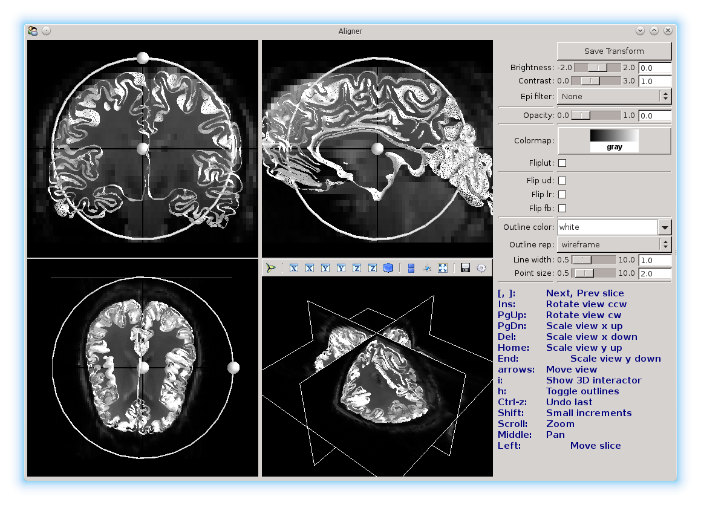

Here you see 4 different views, showing the saggital, coronal, and transverse slices, and also the three slices in 3D.
The background image is the reference image, and the mesh that you see is the surface that you will be aligning.
You'll be moving the mesh until it's aligned as much as possible with the reference.

To make things easier to see, the aligner offers different color options.

Changing the views
~~~~~~~~~~~~~~~~~~

You can change the color scale for the images with the color map option:

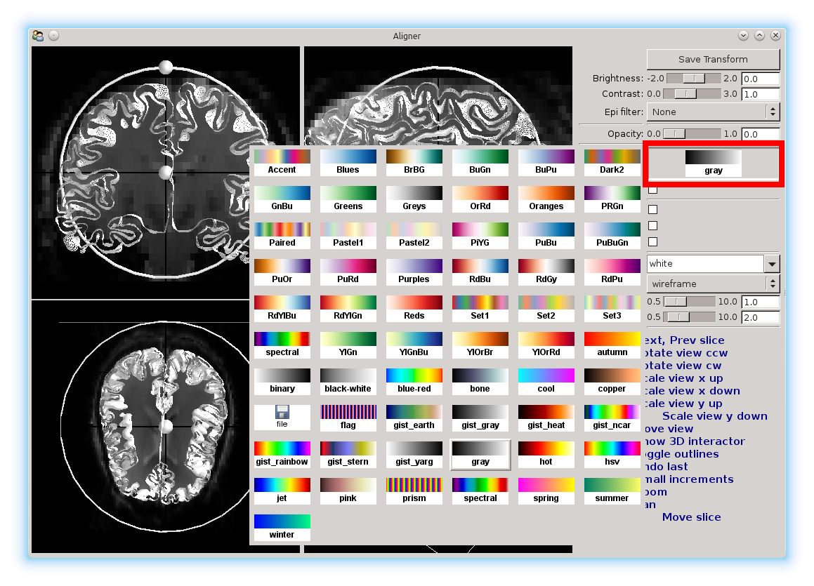

Here, we've set it to the red-blue color map.

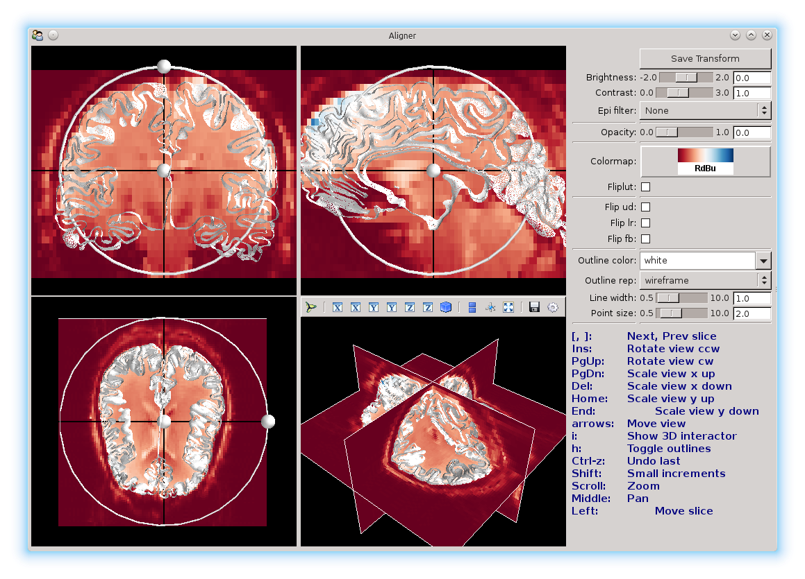

``Fliplut`` can be used to reverse the color map.

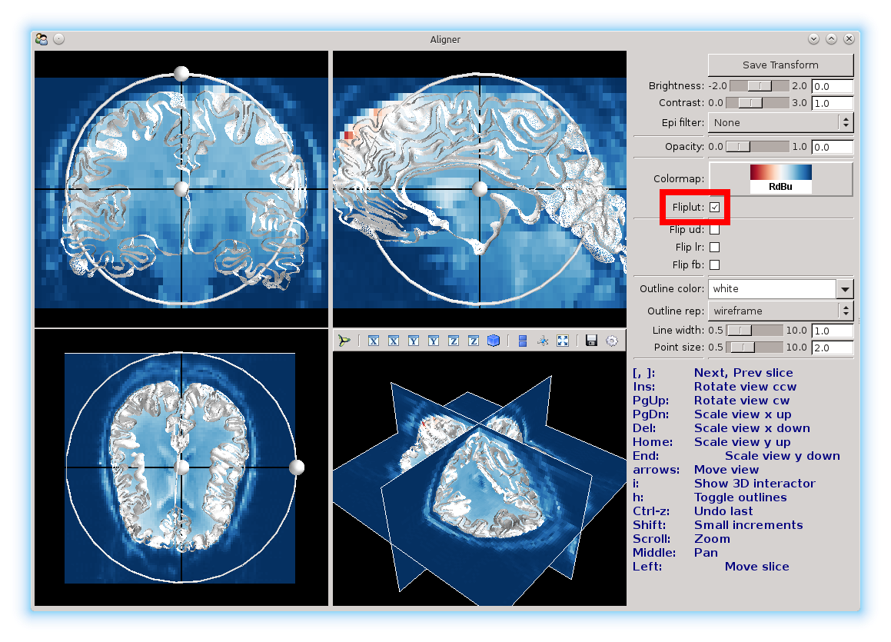

You can also use the ``contrast`` and ``brightness`` sliders to adjust the colors.

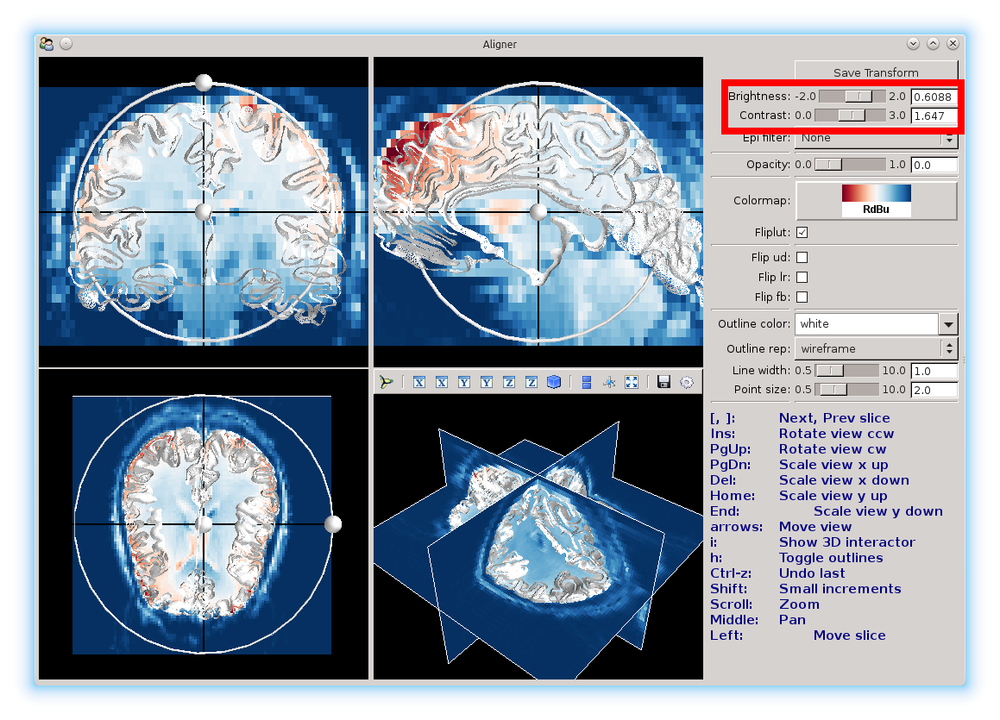

The ``Outline color`` and ``Outline rep`` can be used to change the surface color, and the surface from a mesh (the default), to points only, to a solid surface.
Also, the sliders can be used to chane line and point weights.
Here, we changed it to a green points only representation, with smaller points.

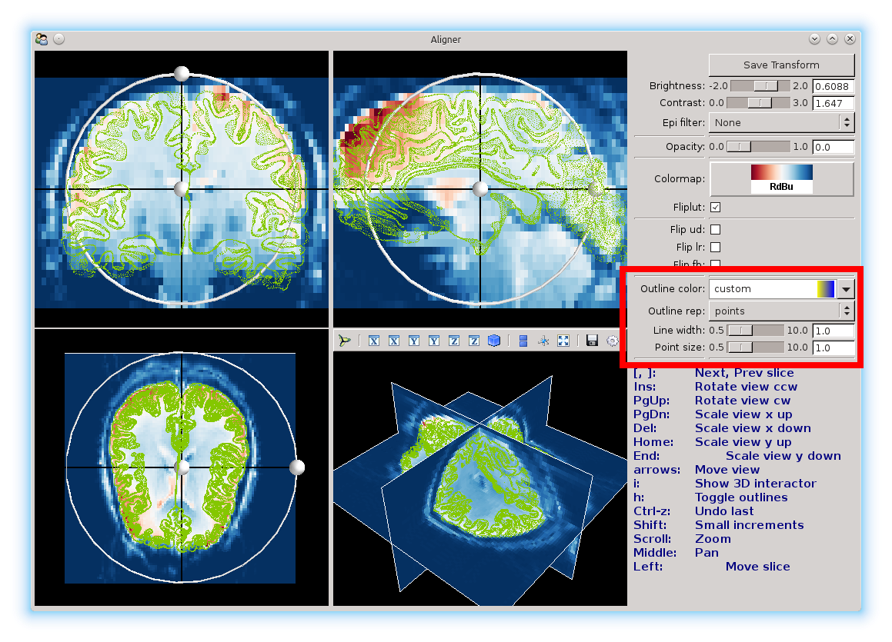

You will notice two black lines in each view. You can click anywhere in a view to select a different voxel.
Selecting another voxel will update all the other views to show the slices that particular voxel belongs to.

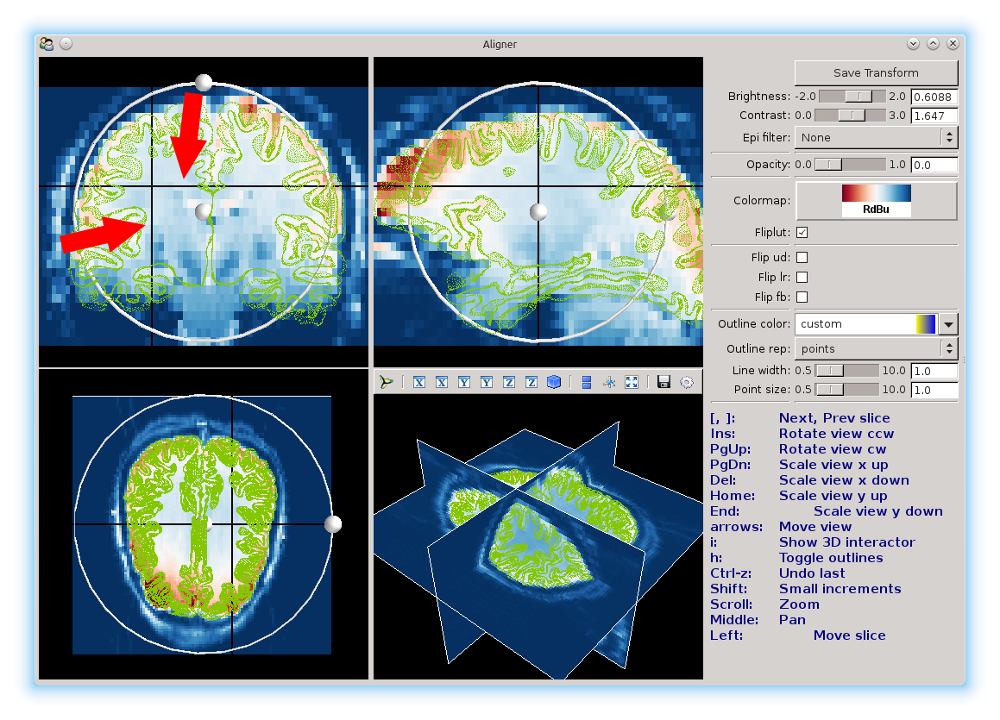

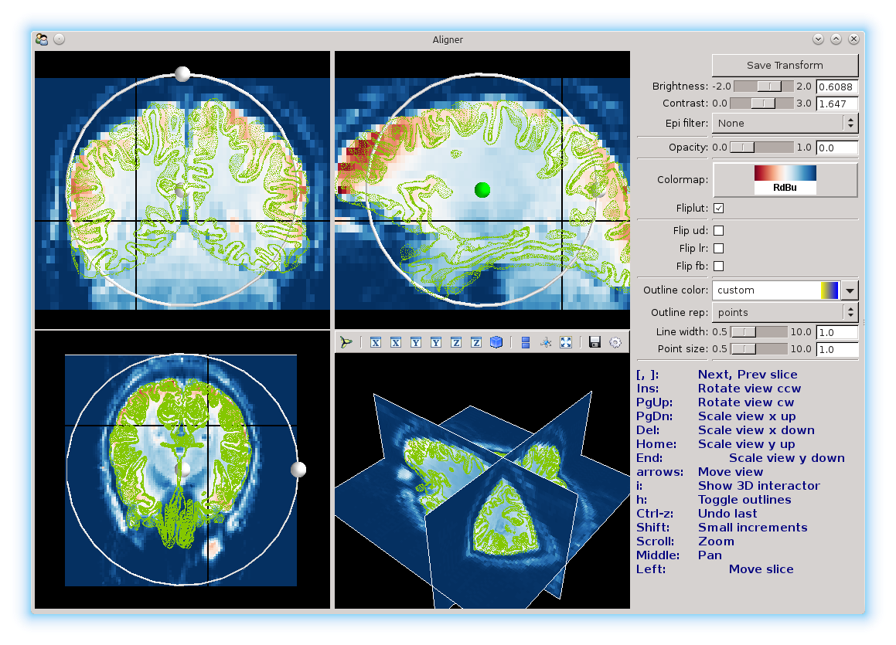

Use these views to change the slices of the brain that you're looking at, to line things up.

Manually aligning the brain
~~~~~~~~~~~~~~~~~~~~~~~~~~~

On each view, there is a ball surrounded by a ring. These can be used to adjust the brain using the mouse.
Click and drag the center ball to translate in each view, and use the ball on the ring to rotate and scale.
It will take a few seconds for the aligner to update the mesh position.

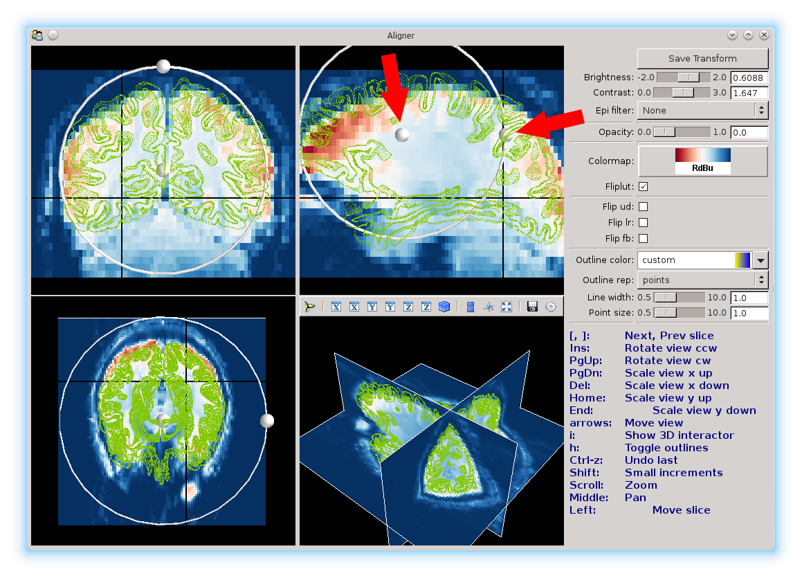
	
**Note**: you should not use the ring to make adjustments. There is no way to fix the scaling, and the ring will screw the scaling up.

You can also use the keyboard to make adjustments.
Holding down the shift key allows you to make fine adjustments.
The aligner will apply the transformation in whatever view currently under your mouse cursor.

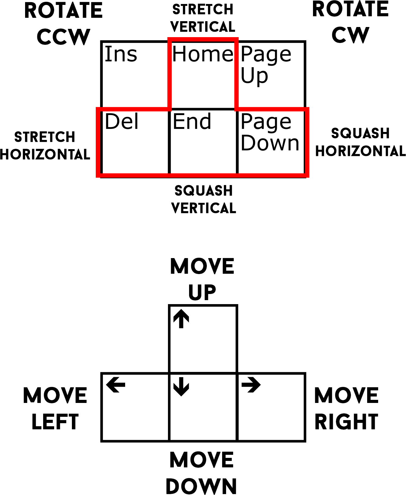
**Note**: you shouldn't touch the keys outlined in red. There is no reason to stretch the brain.

To save the alignment, just click the ``Save Transform`` button and close the window.

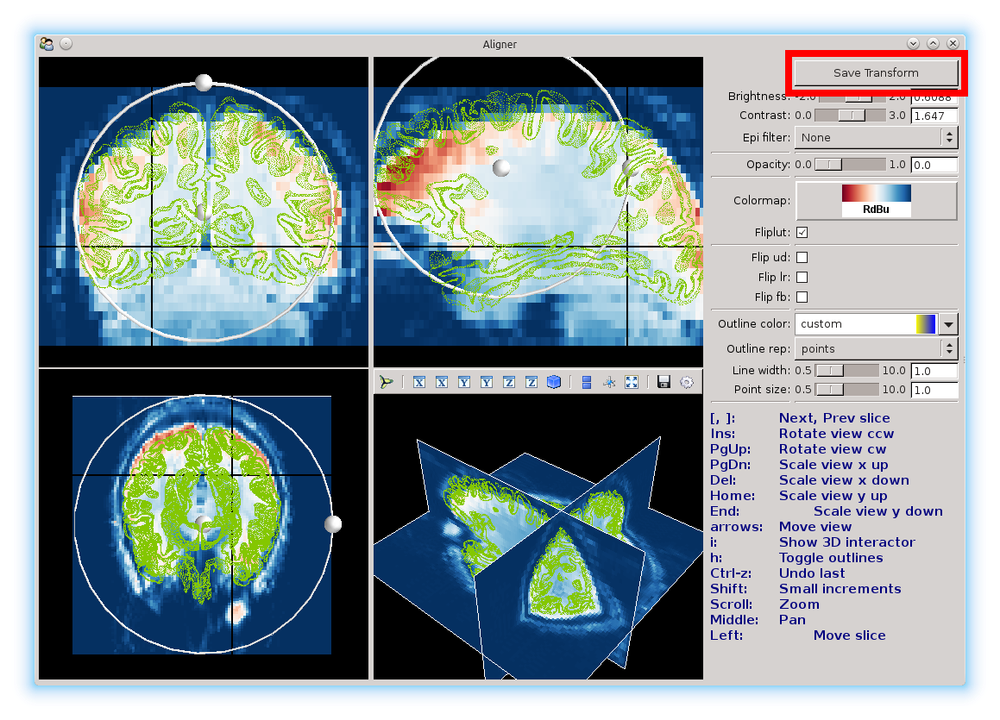

Tips for aligning the brain
~~~~~~~~~~~~~~~~~~~~~~~~~~~
* Holding down the shift key while using the keyboard controls will let you move the brain in fine-tuned, smaller increments.
* The really deep sulci work great as landmarks to align stuff up.
* Changing the color map, brightness, and contrast really helps highlight the sulci.
* To check how well the brain is aligned, make a flatmap out of the reference image using the transformation. A good alignment results in a smooth color gradient across the brain; bad ones will have a lot of voxels that are starkly different from their neighbours.