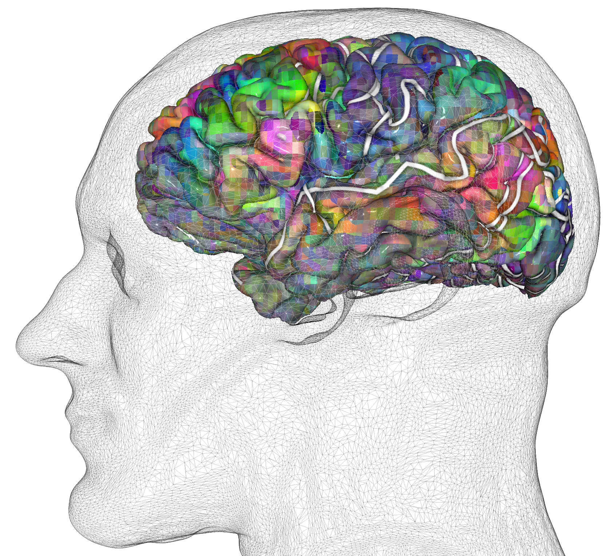

Pycortex Documentation
======================

Pycortex is a software package for generating beautiful interactive 3D visualizations of fMRI data projected onto cortical surface models. It can also generate high quality 2D flattened cortical visualizations.

This documentation is still under development. Please report errors or bugs at https://github.com/gallantlab/pycortex/issues.

Quickstart
-----------

User Guide
----------
.. toctree::
   :maxdepth: 2
   
   install
   segmentation_guide
   database
   align
   .. dataset
   rois
   transforms
   colormaps

Example Gallery
---------------
.. toctree::
    :maxdepth: 3
    
    auto_examples/index

API Reference
-------------
.. toctree::
    api_reference_flat

Citation
--------
If you use pycortex in published work, please cite the `pycortex paper <http://dx.doi.org/10.3389/fninf.2015.00023>`_:

*Gao JS, Huth AG, Lescroart MD and Gallant JL (2015) Pycortex: an interactive surface visualizer for fMRI. Front. Neuroinform. 9:23. doi: 10.3389/fninf.2015.00023*

Indices and tables
==================

* :ref:`genindex`
* :ref:`modindex`
* :ref:`search`

