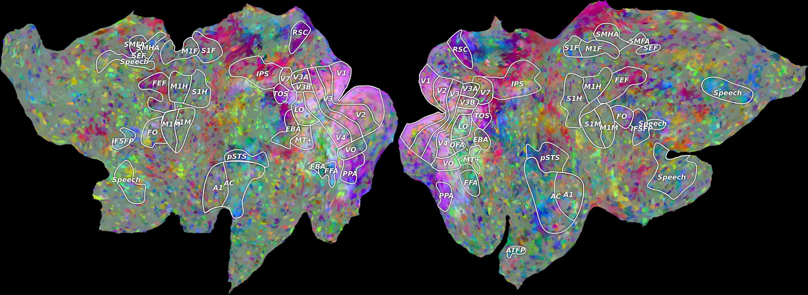

.. pycortex documentation master file, created by
   sphinx-quickstart on Thu Sep 13 19:15:55 2012.
   You can adapt this file completely to your liking, but it should at least
   contain the root `toctree` directive.

Welcome to pycortex!
====================

pycortex is a package that provides an accessible way to store a database of surface reconstructions for anatomical MRI images. Additionally, tools are provided to align epi fMRI images with the reconstructions, and project data from the epi to the anatomicals.

For example::
    
    from cortex import view
    im = view.quickflat("AH", "AH_huth", np.random.randn(32, 100, 100))

    from matplotlib import pylab
    pylab.imshow(im)
    pylab.show()

Contents:

.. toctree::
   :maxdepth: 3
   
   install
   database
   align
   view

Indices and tables
==================

* :ref:`genindex`
* :ref:`modindex`
* :ref:`search`

