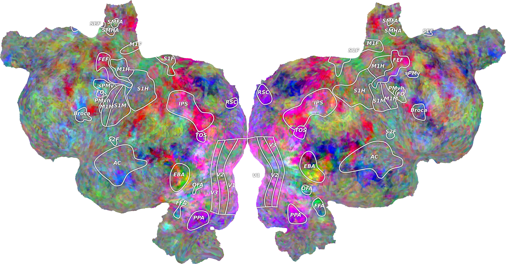

.. pycortex documentation master file, created by
   sphinx-quickstart on Thu Sep 13 19:15:55 2012.
   You can adapt this file completely to your liking, but it should at least
   contain the root `toctree` directive.

Welcome to pycortex!
====================

pycortex is a package that provides an accessible way to store a database of surface reconstructions for anatomical MRI images. Additionally, tools are provided to coregister epi fMRI images with the reconstructions, and project data from the epi to the anatomicals. 

This documentation is still under development, and may contain inaccurate information. If you find anything that appears to be documented incorrectly or appears to be a bug, please let us know on github at https://github.com/jamesgao/pycortex/issues.

For example::
    
    import cortex
    im = cortex.quickshow((np.random.randn(32, 100, 100), "S1", "fullhead"))

Contents:

.. toctree::
   :maxdepth: 3
   
   install
   segmentation
   database
   align
   dataset
   rois
   transforms

Indices and tables
==================

* :ref:`genindex`
* :ref:`modindex`
* :ref:`search`

